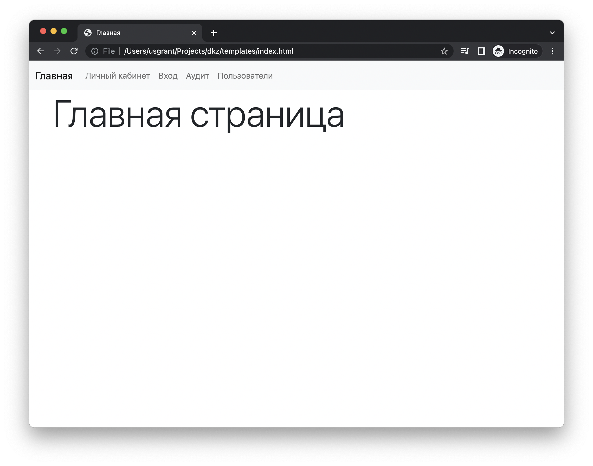

# Архитектура MVC

**MVC** (model-view-controller – модель-представление-контроллер) – это паттерн проектирования веб-приложений, который разделяет приложение на три отдельных компонента: модель данных, пользовательский интерфейс и логика взаимодействия пользователя с системой, благодаря чему модификация одного из этих компонентов оказывает минимальное воздействие на остальные или не оказывает его вовсе.

### Компоненты MVC:

1. **Модель / Model** - предоставляет собой объектную модель некой предметной области, включает в себя данные и методы работы с этими данными, реагирует на запросы из контроллера, возвращая данные и/или изменяя своё состояние. При этом модель не содержит в себе информации о способах визуализации данных или форматах их представления, а также не взаимодействует с пользователем напрямую.
2. **Представление / View** – отвечает за отображение информации (визуализацию). Одни и те же данные могут представляться различными способами и в различных форматах.
3. **Контроллер / Controller** - обеспечивает связь между пользователем и системой, использует модель и представление для реализации необходимой реакции на действия пользователя. Как правило, на уровне контроллера осуществляется фильтрация полученных данных и авторизация — проверяются права пользователя на выполнение действий или получение информации.

В рамках выполнения задания моделью будут являться классы, представляющие данные из БД, представлением - HTML-страницы, контроллером - файл `app.py`, обеспечивающий логику работы приложения.

# Порядок выполнения задания

Далее представлен примерный порядок выполнения задания, с использованием языка программирования `python` и микрофреймворка `flask`. Кроме того, для создания интерфейса используется библиотека стилей `bootstrap`.

## Структура проекта Flask.

-   файл `app.py`, содержащий логику работы приложения (контроллер MVC)
-   папка `templates`, содержащая шаблоны html-страницы (представление MVC)
-   папка `static`, содержащая статические ресурсы html-старниц (изображения, скрипты, стили)
-   папка `models`, содержащая `python`-классы, реализующие слой модели MVC.

## Создание статических web-страниц

Начало работы предлагается с создания представлений - HTML-страниц.

### Создание главной страницы

Главная страница - `index.html`. Содержимое страницы не имеет принципиального значения.

```html
<!DOCTYPE html>
<html lang="en">
    <head>
        <meta charset="UTF-8" />
        <meta http-equiv="X-UA-Compatible" content="IE=edge" />
        <meta name="viewport" content="width=device-width, initial-scale=1.0" />
        <title>Главная</title>
        <link rel="stylesheet" href="./css/bootstrap.min.css" />
        <link rel="stylesheet" href="./css/style.css" />
        <script defer src="./js/jquery.js"></script>
        <script defer src="./js/popper.js"></script>
        <script defer src="./js/bootstrap.js"></script>
    </head>
    <body>
        <nav class="navbar navbar-expand-lg navbar-light bg-light">
            <div class="container-fluid">
                <a class="navbar-brand" href="index.html">Главная</a>
                <button
                    class="navbar-toggler"
                    type="button"
                    data-toggle="collapse"
                    data-target="#navbarSupportedContent"
                    aria-controls="navbarSupportedContent"
                    aria-expanded="false"
                    aria-label="Toggle navigation"
                >
                    <span class="navbar-toggler-icon"></span>
                </button>
                <div class="collapse navbar-collapse" id="navbarSupportedContent">
                    <ul class="navbar-nav mr-auto mb-2 mb-lg-0">
                        <li class="nav-item">
                            <a class="nav-link" href="login.html">Вход</a>
                        </li>
                        <li class="nav-item">
                            <a class="nav-link" href="profile.html">Личный кабинет</a>
                        </li>
                        <li class="nav-item">
                            <a class="nav-link" href="audit.html">Аудит</a>
                        </li>
                        <li class="nav-item">
                            <a class="nav-link" href="accounts.html">Пользователи</a>
                        </li>
                    </ul>
                </div>
            </div>
        </nav>
        <div class="container">
            <div class="row">
                <div class="col-12">
                    <h1 class="display-1">Главная страница</h1>
                </div>
            </div>
        </div>
    </body>
</html>
```



### Создание страницы авторизации

Страница авторизации - `login.html`. На этой странице должны быть форма для ввода имени пользователя и пароля.

> Обратите внимание, что на тэге `form` установлены атрибуты `action` и `method`, а также на то, что у каждого тэга `input` присутствует атрибут `name`. Эта информация понадобится нам позже.

```html
<!DOCTYPE html>
<html lang="en">
    <head>
        <meta charset="UTF-8" />
        <meta http-equiv="X-UA-Compatible" content="IE=edge" />
        <meta name="viewport" content="width=device-width, initial-scale=1.0" />
        <title>Вход</title>
        <link rel="stylesheet" href="./css/bootstrap.min.css" />
        <link rel="stylesheet" href="./css/style.css" />
        <script defer src="./js/jquery.js"></script>
        <script defer src="./js/popper.js"></script>
        <script defer src="./js/bootstrap.js"></script>
    </head>
    <body>
        <nav class="navbar navbar-expand-sm navbar-light bg-light">
            <div class="container-fluid">
                <a class="navbar-brand" href="index">Главная</a>
                <button
                    class="navbar-toggler"
                    type="button"
                    data-toggle="collapse"
                    data-target="#navbarSupportedContent"
                    aria-controls="navbarSupportedContent"
                    aria-expanded="false"
                    aria-label="Toggle navigation"
                >
                    <span class="navbar-toggler-icon"></span>
                </button>
                <div class="collapse navbar-collapse" id="navbarSupportedContent">
                    <ul class="navbar-nav mr-auto mb-2 mb-lg-0">
                        <li class="nav-item">
                            <a class="nav-link" href="profile">Личный кабинет</a>
                        </li>
                        <li class="nav-item">
                            <a class="nav-link" href="login">Вход</a>
                        </li>
                        <li class="nav-item">
                            <a class="nav-link" href="audit">Аудит</a>
                        </li>
                        <li class="nav-item">
                            <a class="nav-link" href="accounts">Пользователи</a>
                        </li>
                    </ul>
                </div>
            </div>
        </nav>
        <div class="content-login">
            <div class="card">
                <div class="card-body">
                    <span class="h2">Вход в систему</span>
                    <div class="alert alert-danger mt-3">Неверное имя пользователя или пароль</div>
                    <form action="/login" method="POST">
                        <div class="form-group mt-3">
                            <label for="username">Имя пользователя</label>
                            <input type="text" class="form-control" id="username" name="username" />
                        </div>
                        <div class="form-group mt-3">
                            <label for="password">Пароль</label>
                            <input type="password" class="form-control" id="password" name="password" />
                        </div>
                        <button type="submit" class="btn btn-primary mt-4 w-100">Вход</button>
                    </form>
                </div>
            </div>
        </div>
    </body>
</html>
```


Здесь красный блок с надписью “Неверное имя пользователя или пароль” по умолчанию видимый, однако в дальнейшем с помощью flask мы его скроем и будем показывать только тогда, когда пользователь будет вводить неверные данные.

### Создание страницы со списком пользователей

Страница со списком пользователей - `accounts.html.` Пока добавьте в нее тестовые данные. Список реальных пользователей мы подключим позже.

> Обратите внимание, что на тэге `form` в каждой строке таблицы установлены атрибуты `action` и `method`, а также на то, что на каждой строке таблицы присутствует `input` с атрибутам `type="hidden"` , то есть скрытый. Эта информация понадобится нам позже.

```html
<!DOCTYPE html>
<html lang="en">
    <head>
        <meta charset="UTF-8" />
        <meta http-equiv="X-UA-Compatible" content="IE=edge" />
        <meta name="viewport" content="width=device-width, initial-scale=1.0" />
        <title>Управление пользователями</title>
        <link rel="stylesheet" href="./css/bootstrap.min.css" />
        <link rel="stylesheet" href="./css/style.css" />
        <script defer src="./js/jquery.js"></script>
        <script defer src="./js/popper.js"></script>
        <script defer src="./js/bootstrap.js"></script>
    </head>
    <body>
        <nav class="navbar navbar-expand-sm navbar-light bg-light">
            <div class="container-fluid">
                <a class="navbar-brand" href="/">Главная</a>
                <button
                    class="navbar-toggler"
                    type="button"
                    data-toggle="collapse"
                    data-target="#navbarSupportedContent"
                    aria-controls="navbarSupportedContent"
                    aria-expanded="false"
                    aria-label="Toggle navigation"
                >
                    <span class="navbar-toggler-icon"></span>
                </button>
                <div class="collapse navbar-collapse" id="navbarSupportedContent">
                    <ul class="navbar-nav mr-auto mb-2 mb-lg-0">
                        <li class="nav-item">
                            <a class="nav-link" href="profile">Личный кабинет</a>
                        </li>
                        <li class="nav-item">
                            <a class="nav-link" href="login">Вход</a>
                        </li>
                        <li class="nav-item">
                            <a class="nav-link" href="audit">Аудит</a>
                        </li>
                        <li class="nav-item">
                            <a class="nav-link" href="accounts">Пользователи</a>
                        </li>
                    </ul>
                </div>
            </div>
        </nav>
        <div class="container mt-3">
            <div class="row">
                <div class="col-12">
                    <div class="d-flex flex-row justify-content-between align-items-center">
                        <span class="display-4">Список пользователей</span>
                        <a href="#" class="btn btn-primary" data-toggle="modal" data-target="#create-user-modal"
                            >Создать пользователя</a
                        >
                    </div>
                </div>
                <div class="col-12 mt-3">
                    <div class="alert alert-success mt-3">Пользователь добавлен</div>
                    <div class="alert alert-danger mt-3">Такой пользователь существует</div>
                    <table class="table table-striped table-hover mt-3">
                        <thead class="thead-dark">
                            <th>ID</th>
                            <th>Имя пользователя</th>
                            <th>Фамилия</th>
                            <th>Имя</th>
                            <th>Отчество</th>
                            <th>Дата рождения</th>
                            <th>Роль</th>
                            <th></th>
                        </thead>
                        <tbody>
                            <tr>
                                <td>1</td>
                                <td>ivanov</td>
                                <td>Иванов</td>
                                <td>Иван</td>
                                <td>Иванович</td>
                                <td>01.01.2000</td>
                                <td>ADMIN</td>
                                <td>
                                    <form action="/accounts/delete" method="POST">
                                        <input type="hidden" name="id" value="{{ account.id }}" />
                                        <button type="submit" class="btn btn-danger">Удалить</button>
                                    </form>
                                </td>
                            </tr>
                            <tr>
                                <td>2</td>
                                <td>petrov</td>
                                <td>Петров</td>
                                <td>Петр</td>
                                <td>Петрович</td>
                                <td>01.01.2000</td>
                                <td>USER</td>
                                <td>
                                    <form action="/accounts/delete" method="POST">
                                        <input type="hidden" name="id" value="{{ account.id }}" />
                                        <button type="submit" class="btn btn-danger">Удалить</button>
                                    </form>
                                </td>
                            </tr>
                        </tbody>
                    </table>
                </div>
            </div>
        </div>
        <div
            class="modal fade"
            id="create-user-modal"
            tabindex="-1"
            aria-labelledby="create-user-modal"
            aria-hidden="true"
        >
            <div class="modal-dialog">
                <form class="modal-content" action="/accounts" method="POST">
                    <div class="modal-header">
                        <h5 class="modal-title" id="exampleModalLabel">Создание пользователя</h5>
                    </div>
                    <div class="modal-body">
                        <div class="form-group">
                            <label for="username">Имя пользователя</label>
                            <input type="text" class="form-control" id="username" name="username" />
                        </div>
                        <div class="form-group">
                            <label for="lastname">Фамилия</label>
                            <input type="text" class="form-control" id="lastname" name="lastname" />
                        </div>
                        <div class="form-group mt-3">
                            <label for="firstname">Имя</label>
                            <input type="text" class="form-control" id="firstname" name="firstname" />
                        </div>
                        <div class="form-group mt-3">
                            <label for="middlename">Отчество</label>
                            <input type="text" class="form-control" id="middlename" name="middlename" />
                        </div>
                        <div class="form-group mt-3">
                            <label for="password">Пароль</label>
                            <input type="password" class="form-control" id="password" name="password" />
                        </div>
                        <div class="form-group mt-3">
                            <label for="confirm-password">Повторите пароль</label>
                            <input type="password" class="form-control" id="confirm-password" name="confirm-password" />
                        </div>
                        <div class="form-group mt-3">
                            <label for="role">Роль</label>
                            <select class="form-control" id="role" name="role">
                                <option value="admin">Администратор</option>
                                <option value="user">Пользователь</option>
                            </select>
                        </div>
                    </div>
                    <div class="modal-footer">
                        <button type="button" class="btn btn-secondary" data-dismiss="modal">Отмена</button>
                        <button type="submit" class="btn btn-primary">Сохранить изменения</button>
                    </div>
                </form>
            </div>
        </div>
    </body>
</html>
```


Ошибка “Такой пользователь существует” будет показываться тогда, когда будет производится попытка создать пользователя с одним и тем же именем пользователя. А сообщение “Пользователь добавлен” - когда будет добавлен новый пользователь в базу данных.

На данной странице также присутствует модальное окно, которое появляется при нажатии на кнопку “Создать пользователя”.

> Обратите внимание, что на тэге `form` в модельном окне установлены атрибуты `action` и `method`, а также на то, что у каждого тэга `input` присутствует атрибут `name`. Эта информация понадобится нам позже.


### Создание страницы аудита.

Страница аудита - `audit.html`. Для начала добавьте на нее тестовые данные. Реальные данные аудита мы подключим позже.

```html
<!DOCTYPE html>
<html lang="en">
    <head>
        <meta charset="UTF-8" />
        <meta http-equiv="X-UA-Compatible" content="IE=edge" />
        <meta name="viewport" content="width=device-width, initial-scale=1.0" />
        <title>Аудит</title>
        <link rel="stylesheet" href="./css/bootstrap.min.css" />
        <link rel="stylesheet" href="./css/style.css" />
        <script defer src="./js/jquery.js"></script>
        <script defer src="./js/popper.js"></script>
        <script defer src="./js/bootstrap.js"></script>
    </head>
    <body>
        <nav class="navbar navbar-expand-sm navbar-light bg-light">
            <div class="container-fluid">
                <a class="navbar-brand" href="index.html">Главная</a>
                <button
                    class="navbar-toggler"
                    type="button"
                    data-toggle="collapse"
                    data-target="#navbarSupportedContent"
                    aria-controls="navbarSupportedContent"
                    aria-expanded="false"
                    aria-label="Toggle navigation"
                >
                    <span class="navbar-toggler-icon"></span>
                </button>
                <div class="collapse navbar-collapse" id="navbarSupportedContent">
                    <ul class="navbar-nav mr-auto mb-2 mb-lg-0">
                        <li class="nav-item">
                            <a class="nav-link" href="profile.html">Личный кабинет</a>
                        </li>
                        <li class="nav-item">
                            <a class="nav-link" href="login.html">Вход</a>
                        </li>
                        <li class="nav-item">
                            <a class="nav-link" href="audit.html">Аудит</a>
                        </li>
                        <li class="nav-item">
                            <a class="nav-link" href="accounts.html">Пользователи</a>
                        </li>
                    </ul>
                </div>
            </div>
        </nav>
        <div class="container mt-3">
            <div class="row">
                <div class="col-12">
                    <span class="display-4">Таблица аудита</span>
                </div>
                <div class="col-12 mt-3">
                    <table class="table table-striped table-hover">
                        <thead class="thead-dark">
                            <th>ID</th>
                            <th>Дата</th>
                            <th>Время</th>
                            <th>Тип</th>
                            <th>Пользователь</th>
                            <th>Событие</th>
                        </thead>
                        <tbody>
                            <tr>
                                <td>1</td>
                                <td>01.01.2022</td>
                                <td>10:00:00</td>
                                <td>INFO</td>
                                <td>ADMIN</td>
                                <td>LOGIN</td>
                            </tr>
                            <tr>
                                <td>2</td>
                                <td>01.01.2022</td>
                                <td>10:01:00</td>
                                <td>INFO</td>
                                <td>ADMIN</td>
                                <td>LOGOUT</td>
                            </tr>
                            <tr>
                                <td>3</td>
                                <td>01.01.2022</td>
                                <td>10:00:00</td>
                                <td>INFO</td>
                                <td>ADMIN</td>
                                <td>LOGIN</td>
                            </tr>
                            <tr>
                                <td>4</td>
                                <td>01.01.2022</td>
                                <td>10:01:00</td>
                                <td>INFO</td>
                                <td>ADMIN</td>
                                <td>LOGOUT</td>
                            </tr>
                            <tr>
                                <td>5</td>
                                <td>01.01.2022</td>
                                <td>10:00:00</td>
                                <td>INFO</td>
                                <td>ADMIN</td>
                                <td>LOGIN</td>
                            </tr>
                            <tr>
                                <td>6</td>
                                <td>01.01.2022</td>
                                <td>10:01:00</td>
                                <td>INFO</td>
                                <td>ADMIN</td>
                                <td>LOGOUT</td>
                            </tr>
                            <tr>
                                <td>7</td>
                                <td>01.01.2022</td>
                                <td>10:00:00</td>
                                <td>INFO</td>
                                <td>ADMIN</td>
                                <td>LOGIN</td>
                            </tr>
                            <tr>
                                <td>8</td>
                                <td>01.01.2022</td>
                                <td>10:01:00</td>
                                <td>INFO</td>
                                <td>ADMIN</td>
                                <td>LOGOUT</td>
                            </tr>
                        </tbody>
                    </table>
                </div>
            </div>
        </div>
    </body>
</html>
```


### Создание страницы личного кабинета пользователя

Личный кабинет пользователя - страница `profile.html`. Данные пользователя будем выводить в тэгах `input`, чтобы в дальнейшем иметь возможность редактировать пользователя.

> Обратите внимание, что на тэге `form` установлены атрибуты `action` и `method`, а также на то, что у каждого тэга `input` присутствует атрибут `name`. Эта информация понадобится нам позже.

```html
<!DOCTYPE html>
<html lang="en">
    <head>
        <meta charset="UTF-8" />
        <meta http-equiv="X-UA-Compatible" content="IE=edge" />
        <meta name="viewport" content="width=device-width, initial-scale=1.0" />
        <title>Личный кабинет</title>
        <link rel="stylesheet" href="./css/bootstrap.min.css" />
        <link rel="stylesheet" href="./css/style.css" />
        <script defer src="./js/jquery.js"></script>
        <script defer src="./js/popper.js"></script>
        <script defer src="./js/bootstrap.js"></script>
    </head>
    <body>
        <nav class="navbar navbar-expand-sm navbar-light bg-light">
            <div class="container-fluid">
                <a class="navbar-brand" href="index.html">Главная</a>
                <button
                    class="navbar-toggler"
                    type="button"
                    data-toggle="collapse"
                    data-target="#navbarSupportedContent"
                    aria-controls="navbarSupportedContent"
                    aria-expanded="false"
                    aria-label="Toggle navigation"
                >
                    <span class="navbar-toggler-icon"></span>
                </button>
                <div class="collapse navbar-collapse" id="navbarSupportedContent">
                    <ul class="navbar-nav mr-auto mb-2 mb-lg-0">
                        <li class="nav-item">
                            <a class="nav-link" href="profile.html">Личный кабинет</a>
                        </li>
                        <li class="nav-item">
                            <a class="nav-link" href="login.html">Вход</a>
                        </li>
                        <li class="nav-item">
                            <a class="nav-link" href="audit.html">Аудит</a>
                        </li>
                        <li class="nav-item">
                            <a class="nav-link" href="accounts.html">Пользователи</a>
                        </li>
                    </ul>
                </div>
            </div>
        </nav>
        <div class="container">
            <div class="row">
                <span class="h1 mt-3">Личный кабинет пользователя</span>
            </div>
            <div class="row">
                <div class="col-12">
                    <div class="alert alert-success mt-3">Изменения сохранены</div>
                </div>
            </div>
            <div class="row">
                <div class="col-12">
                    <div class="alert alert-danger mt-3">Ошибка!</div>
                </div>
            </div>
            <form class="row" action="/accounts/edit" method="POST">
                <div class="col-12 col-sm-6">
                    <div class="form-group mt-3">
                        <label for="username">Имя пользователя</label>
                        <input type="text" class="form-control" id="username" name="username" />
                    </div>
                </div>
                <div class="col-12 col-sm-6">
                    <div class="form-group mt-3">
                        <label for="lastname">Фамилия</label>
                        <input type="text" class="form-control" id="lastname" name="lastname" />
                    </div>
                </div>
                <div class="col-12 col-sm-6">
                    <div class="form-group mt-3">
                        <label for="firstname">Имя</label>
                        <input type="text" class="form-control" id="firstname" name="firstname" />
                    </div>
                </div>
                <div class="col-12 col-sm-6">
                    <div class="form-group mt-3">
                        <label for="middlename">Отчество</label>
                        <input type="text" class="form-control" id="middlename" name="middlename" />
                    </div>
                </div>
                <div class="col-12 col-sm-6">
                    <div class="form-group mt-3">
                        <label for="password">Пароль</label>
                        <input type="password" class="form-control" id="password" name="password" />
                    </div>
                </div>
                <div class="col-12 col-sm-6">
                    <div class="form-group mt-3">
                        <label for="confirm-password">Повторите пароль</label>
                        <input type="password" class="form-control" id="confirm-password" name="confirm-password" />
                    </div>
                </div>
                <div class="col-12">
                    <button type="submit" class="btn btn-primary mt-3 float-end">Сохранить</button>
                </div>
            </form>
        </div>
    </body>
</html>
```


Блоки “Изменения сохранены” и “Ошибка” будут показываться при успешном либо неуспешном изменении пользователем его данных соответственно.

### Создание дополнительных файлов

Также для корректного отображения данных страниц необходимо подключить css-библиотеку bootstrap. Из библиотеки понадобится файл `bootstrap.min.css` и `bootstrap.js`, а также библиотеки `jquery` и `popper.js`. Для их подключения можно воспользоваться файлами из данного репозитория, либо подключить их из CDN. Подробнее смотрите в документации по bootstrap.

Кроме того, присутствует также файл `style.css` со стилями для страницы `login.html`. Его содержимое представлено ниже.

```css
.content-login {
    width: 100%;
    height: calc(100vh - 74px);
    display: flex;
    justify-content: center;
    align-items: center;
}
.content-login > .card {
    min-width: 300px;
}

@media (max-width: 576px) {
    .content-login > .card {
        margin: auto 10px;
        min-width: 100%;
    }
}
```

На этом создание страниц завершено. Можно перейти к созданию web-приложения.

## Разработка web-приложения

### Создание виртуального окружения python

Язык программирования Python, как многие другие языки, обладает своим уникальным способом загрузки и хранения пакетов (модулей) с помощью утилиты `pip`. Это имеет как плюсы, так и минусы. Дело в том, что есть несколько расположений, где сохраняются пакеты, установленные в системе.

Представьте простую ситуацию: у вас 2 пакета (ProjectA and ProjectB). Оба связаны зависимостью с одной и той же библиотекой — ProjectC. Если же мы начнём запрашивать различные версии ProjectC, могут возникнуть затруднения. ProjectA может запросить одну версию (1.0), а ProjectB — другую, более новую (2.0). Раз проекты хранятся с учётом их названий, различий между версиями нет, в результате чего ProjectA и ProjectB будут применять одну и ту же версию, а это не есть хорошо.

Как раз здесь на сцену и выходит виртуальное окружение (среда) Python, делая это совместно с инструментами _virtualenv/ven_.

Согласно официальной документации языка, виртуальное окружение Python – это «автономное дерево каталогов, которое содержит пакет установки для конкретной версии Python, а также ряд дополнительных пакетов».

Основной задачей виртуального окружения в языке Python является создание изолированной среды для python-проектов. Это значит, что

-   любой проект способен иметь собственные зависимости;
-   зависимости второго проекта не оказывают влияния на зависимости первого и наоборот.

Если вернуться к примеру выше, становится очевидным, что следует просто разделить виртуальные окружения для ProjectA и ProjectB. В итоге каждая отдельная среда будет зависеть от любой версии ProjectC и не зависеть друг от друга.

Виртуальные окружения довольно легко создать, используя средства командной строки `virtualenv` либо `pyenv` для Python.

Для начала в корне проекта создайте виртуальное окружения для `python` и активируйте его.

```bash
python3 -m venv .env
source .env/bin/activate
```

> Предполагается, что вы уже знакомы, что такое виртуальное окружение `python` и для чего оно нужно. Поэтому подробно останавливаться на этом не будем. Все дальнейшие команды будут выполнятся внутри данного окружения. Кроме того, команды представлены для оболочки `bash` **Unix-подобных операционных систем**. Для работы в Windows читайте соответсвующую документацию.

### Создание каркаса приложения

В корне проекта создайте файл `app.py`. Затем также в корне проекта создайте папку `templates` и переместите туда все свои html-страницы. Затем в корне проекта создайте папку `static` и переместите туда все статические ресурсы - скрипты и стили. В данном примере структура проекта будет выглядеть следующим образом.


### Установка фреймворка Flask

Установите фреймворк `flask` с помощью менеждера пакетов `pip`.

```bash
pip install flask
```

### Создание минимального приложения flask

Добавьте в файл `app.py` следующее содержимое.

```python
from flask import Flask, render_template

app = Flask(__name__)

@app.route('/', methods=["GET"])
def index():
    return render_template("index.html")
```

В данном коде мы импортировали основной класс `Flask` и функцию `render_template` из модуля `flask`. С помощью класса Flask мы создали экземпляр приложения `app`. Затем мы определили функцию `index`, которая возвращает результат работы функции `render_template`. Функция `render_template` предназначена для того, чтобы вернуть пользователю один из html ашблонов, которые находятся в каталоге `templates`. В данном случае он вернет страницу `index.html`. С помощью декоратора `@app.route('/', methods=["GET"])` мы определили, что это шаблон будет возвращен пользователю, когда он обратиться по маршруту `/` с помощью метода `GET`. Фактически это означает, что пользователь должен ввести в браузере строку `http://<адрес_сайта>/` .

Для проверки работы приложения необходимо запустить `flask` с помощью команды

```bash
flask run --port 8000
```

С помощью параметра `--port 8000` мы указали, что наше приложение будет работать на порту 8000. По умолчанию порт 5000, если этот параметр не указать.


Как видно, страница загрузилась, но без стилей. Дело в том, каким образом `flask` работает со статичным содержимым web-приложения.

В контексте `flask` статичным содержимым являются шрифты, изображения, файлы css-стилей и js-скриптов. flask считатет их статичными, потому что сам никак не взаимодейтсвует с ними. По большому счету, web-приложени е нет разницы, какого цвета у вас кнопка на странице.

Все статические ресурсы должны быть скопированы в каталог `static`. В нашем примере это папка `js` с библиотеками, и папка `css` с библиотекой и нашим файлом `style.css`.

Можно сказать `flask`-ку, чтобы он указал правильный путь к ресурсам из папки static. Для этого нужно воспользоваться функцией `url_for`. Данную функцию необходимо писать в html-файле. Обратите внимание, что это функция будет работать только во `flask`!

Соответвенно, в секции `<head>` каждой страницы необходимо заменить

```html
<link rel="stylesheet" href="./css/bootstrap.min.css" />
<link rel="stylesheet" href="./css/style.css" />
<script defer src="./js/jquery.js"></script>
<script defer src="./js/popper.js"></script>
<script defer src="./js/bootstrap.js"></script>
```

на

```html
<link rel="stylesheet" href={{ url_for('static',filename='css/bootstrap.min.css') }} />
<link rel="stylesheet" href={{ url_for('static',filename='css/style.css') }} />
<script defer src={{ url_for('static',filename='js/jquery.js') }}></script>
<script defer src={{ url_for('static',filename='js/popper.js') }}></script>
<script defer src={{ url_for('static',filename='js/bootstrap.js') }}></script>
```

Чтобы проверить результат, необхожимо перезапустить `flask`. для этого в терминале нажать комбинацию клавишь `ctrl+c`, а затем запустить `flask` заново

```bash
flask run --port 8000
```


### Подключение созданных web-старниц к приложенияю.

Аналогично, чтобы подключить остальные страницы, необходимо создать для них маршруты. Для этого в файле `app.py` добавим соответсвующие функции.

```python
from flask import Flask, render_template

app = Flask(__name__)

@app.route("/", methods=["GET"])
def index():
    return render_template("index.html")

@app.route("/audit", methods=["GET"])
def audit():
    return render_template("audit.html")

@app.route("/login", methods=["GET"])
def login():
    return render_template("login.html")

@app.route("/accounts", methods=["GET"])
def accounts():
    return render_template("accounts.html")

@app.route("/profile", methods=["GET"])
def profile():
    return render_template("profile.html")
```

Теперь необходимо перезапустить приложение и проверить работу ссылок. Например, с главной перейти на список пользователей.


Здесь мы увидим сообщение, что страница не найдена. И это будет правильно, поскольку в браузере указан неверный URL-адрес. Несмотря на то, что у нас присутствует страница `accounts.html` в каталоге `templates`, мы не можем обратиться к ней напрямую. Она является шаблоном для `flask`. Это значит, что `flask`, используя специальный шаблонизатор `jinja`, который входит во `flask`, загружает содержимое шаблона, ищет там специальные инструкции, и с помощью них подставляет нужные значения. В нашем случае присутствует только одна специальная инструкция - функция `url_for`.

Тогда каким образом обращаться к нашим страницам? Ответ прост: по маршрутам. Маршруты мы указали в файле `app.py`, в декораторах над функциями.

Соответственно, необходимо в каждом HTML-файле заменить ссылки в соответствии с маршрутами из `app.py`. Для этого в секции `nav` удалить .html на каждой ссылке, а вместо `index.html` поставить `/`.

```html
...
<nav class="navbar navbar-expand-sm navbar-light bg-light">
    <div class="container-fluid">
        <a class="navbar-brand" href="/">Главная</a>
        <button
            class="navbar-toggler"
            type="button"
            data-toggle="collapse"
            data-target="#navbarSupportedContent"
            aria-controls="navbarSupportedContent"
            aria-expanded="false"
            aria-label="Toggle navigation"
        >
            <span class="navbar-toggler-icon"></span>
        </button>
        <div class="collapse navbar-collapse" id="navbarSupportedContent">
            <ul class="navbar-nav mr-auto mb-2 mb-lg-0">
                <li class="nav-item">
                    <a class="nav-link" href="profile">Личный кабинет</a>
                </li>
                <li class="nav-item">
                    <a class="nav-link" href="login">Вход</a>
                </li>
                <li class="nav-item">
                    <a class="nav-link" href="audit">Аудит</a>
                </li>
                <li class="nav-item">
                    <a class="nav-link" href="accounts">Пользователи</a>
                </li>
            </ul>
        </div>
    </div>
</nav>
...
```

Теперь ссылки будут работаь корректно. С этого момента созданные ранее web-страницы мы будем называть шаблонами.


### Применение шаблонизатора jinja для оптимизации шаблонов

Обратите внимание, что каждый раз нам приходится изменять содержимое каждой из страниц, как в случае со ссылками. А если таких страниц будет сотня, что вполне нормально для современных web-приложений, или еще больше? Утомительно менять каждый раз содержимое каждого файла.

У фреймворка `flask` есть механизм, который позволяет строить готовую страницу из блоков. Шаблонизатор `jinja` имеет функцию наследования шаблона, которая специально решает эту проблему. По существу, вы можете перемещать части макета страницы, которые являются общими для всех шаблонов, к базовому шаблону, из которого выводятся все остальные шаблоны. Рассмотрим это на примере.

Создадим файл `base.html` в каталоге `templates`. Содержимым этого файла будет являться общая часть для всех наших страниц - секция `head` и верхнее меню.

```html
<!DOCTYPE html>
<html lang="en">
    <head>
        <meta charset="UTF-8" />
        <meta http-equiv="X-UA-Compatible" content="IE=edge" />
        <meta name="viewport" content="width=device-width, initial-scale=1.0" />
        <title>Главная</title>
        <link rel="stylesheet" href="{{ url_for('static',filename='css/bootstrap.min.css') }}" />
        <link rel="stylesheet" href="{{ url_for('static',filename='css/style.css') }}" />
        <script defer src="{{ url_for('static',filename='js/jquery.js') }}"></script>
        <script defer src="{{ url_for('static',filename='js/popper.js') }}"></script>
        <script defer src="{{ url_for('static',filename='js/bootstrap.js') }}"></script>
    </head>
    <body>
        <nav class="navbar navbar-expand-sm navbar-light bg-light">
            <div class="container-fluid">
                <a class="navbar-brand" href="/">Главная</a>
                <button
                    class="navbar-toggler"
                    type="button"
                    data-toggle="collapse"
                    data-target="#navbarSupportedContent"
                    aria-controls="navbarSupportedContent"
                    aria-expanded="false"
                    aria-label="Toggle navigation"
                >
                    <span class="navbar-toggler-icon"></span>
                </button>
                <div class="collapse navbar-collapse" id="navbarSupportedContent">
                    <ul class="navbar-nav mr-auto mb-2 mb-lg-0">
                        <li class="nav-item">
                            <a class="nav-link" href="profile">Личный кабинет</a>
                        </li>
                        <li class="nav-item">
                            <a class="nav-link" href="login">Вход</a>
                        </li>
                        <li class="nav-item">
                            <a class="nav-link" href="audit">Аудит</a>
                        </li>
                        <li class="nav-item">
                            <a class="nav-link" href="accounts">Пользователи</a>
                        </li>
                    </ul>
                </div>
            </div>
        </nav>
        
    </body>
</html>
```

Обратите внимание на строку ``. Таким образом мы сообщили `jinja`, что в это место необходимо вставить блок с именем `content`. Давайте создадим такой блок на главной странице `index.html`.

```html
 
<div class="container">
    <div class="row">
        <div class="col-12">
            <h1 class="display-1">Главная страница</h1>
        </div>
    </div>
</div>

```

В строке `` обозначено, что мы хотим в качестве базового шаблона использовать шаблон `base.html`. И в `base.html` вместо строки `` шаблонизатор `jinja` подставит содержимое соответствующего блока из `index.html`.

Аналогично поступим с остальными страницами

Страница `accounts.html`

```html
 
<div class="container mt-3">
    <div class="row">
        <div class="col-12">
            <div class="d-flex flex-row justify-content-between align-items-center">
                <span class="display-4">Список пользователей</span>
                <a href="#" class="btn btn-primary" data-toggle="modal" data-target="#create-user-modal"
                    >Создать пользователя</a
                >
            </div>
        </div>
        <div class="col-12 mt-3">
            <div class="alert alert-success mt-3">Пользователь добавлен</div>
            <div class="alert alert-danger mt-3">Такой пользователь существует</div>
            <table class="table table-striped table-hover mt-3">
                <thead class="thead-dark">
                    <th>ID</th>
                    <th>Имя пользователя</th>
                    <th>Фамилия</th>
                    <th>Имя</th>
                    <th>Отчество</th>
                    <th>Дата рождения</th>
                    <th>Роль</th>
                    <th></th>
                </thead>
                <tbody>
                    <tr>
                        <td>1</td>
                        <td>ivanov</td>
                        <td>Иванов</td>
                        <td>Иван</td>
                        <td>Иванович</td>
                        <td>01.01.2000</td>
                        <td>ADMIN</td>
                        <td>
                            <form action="/accounts/delete" method="POST">
                                <input type="hidden" name="id" value="{{ account.id }}" />
                                <button type="submit" class="btn btn-danger">Удалить</button>
                            </form>
                        </td>
                    </tr>
                    <tr>
                        <td>2</td>
                        <td>petrov</td>
                        <td>Петров</td>
                        <td>Петр</td>
                        <td>Петрович</td>
                        <td>01.01.2000</td>
                        <td>USER</td>
                        <td>
                            <form action="/accounts/delete" method="POST">
                                <input type="hidden" name="id" value="{{ account.id }}" />
                                <button type="submit" class="btn btn-danger">Удалить</button>
                            </form>
                        </td>
                    </tr>
                </tbody>
            </table>
        </div>
    </div>
</div>
<div class="modal fade" id="create-user-modal" tabindex="-1" aria-labelledby="create-user-modal" aria-hidden="true">
    <div class="modal-dialog">
        <form class="modal-content" action="/accounts" method="POST">
            <div class="modal-header">
                <h5 class="modal-title" id="exampleModalLabel">Создание пользователя</h5>
            </div>
            <div class="modal-body">
                <div class="form-group">
                    <label for="username">Имя пользователя</label>
                    <input type="text" class="form-control" id="username" name="username" />
                </div>
                <div class="form-group">
                    <label for="lastname">Фамилия</label>
                    <input type="text" class="form-control" id="lastname" name="lastname" />
                </div>
                <div class="form-group mt-3">
                    <label for="firstname">Имя</label>
                    <input type="text" class="form-control" id="firstname" name="firstname" />
                </div>
                <div class="form-group mt-3">
                    <label for="middlename">Отчество</label>
                    <input type="text" class="form-control" id="middlename" name="middlename" />
                </div>
                <div class="form-group mt-3">
                    <label for="password">Пароль</label>
                    <input type="password" class="form-control" id="password" name="password" />
                </div>
                <div class="form-group mt-3">
                    <label for="confirm-password">Повторите пароль</label>
                    <input type="password" class="form-control" id="confirm-password" name="confirm-password" />
                </div>
                <div class="form-group mt-3">
                    <label for="role">Роль</label>
                    <select class="form-control" id="role" name="role">
                        <option value="admin">Администратор</option>
                        <option value="user">Пользователь</option>
                    </select>
                </div>
            </div>
            <div class="modal-footer">
                <button type="button" class="btn btn-secondary" data-dismiss="modal">Отмена</button>
                <button type="submit" class="btn btn-primary">Сохранить изменения</button>
            </div>
        </form>
    </div>
</div>

```

Страница `audit.html`

```html
 
<div class="container mt-3">
    <div class="row">
        <div class="col-12">
            <span class="display-4">Таблица аудита</span>
        </div>
        <div class="col-12 mt-3">
            <table class="table table-striped table-hover">
                <thead class="thead-dark">
                    <th>ID</th>
                    <th>Дата</th>
                    <th>Время</th>
                    <th>Тип</th>
                    <th>Пользователь</th>
                    <th>Событие</th>
                </thead>
                <tbody>
                    <tr>
                        <td>1</td>
                        <td>01.01.2022</td>
                        <td>10:00:00</td>
                        <td>INFO</td>
                        <td>ADMIN</td>
                        <td>LOGIN</td>
                    </tr>
                    <tr>
                        <td>2</td>
                        <td>01.01.2022</td>
                        <td>10:01:00</td>
                        <td>INFO</td>
                        <td>ADMIN</td>
                        <td>LOGOUT</td>
                    </tr>
                    <tr>
                        <td>3</td>
                        <td>01.01.2022</td>
                        <td>10:00:00</td>
                        <td>INFO</td>
                        <td>ADMIN</td>
                        <td>LOGIN</td>
                    </tr>
                    <tr>
                        <td>4</td>
                        <td>01.01.2022</td>
                        <td>10:01:00</td>
                        <td>INFO</td>
                        <td>ADMIN</td>
                        <td>LOGOUT</td>
                    </tr>
                    <tr>
                        <td>5</td>
                        <td>01.01.2022</td>
                        <td>10:00:00</td>
                        <td>INFO</td>
                        <td>ADMIN</td>
                        <td>LOGIN</td>
                    </tr>
                    <tr>
                        <td>6</td>
                        <td>01.01.2022</td>
                        <td>10:01:00</td>
                        <td>INFO</td>
                        <td>ADMIN</td>
                        <td>LOGOUT</td>
                    </tr>
                    <tr>
                        <td>7</td>
                        <td>01.01.2022</td>
                        <td>10:00:00</td>
                        <td>INFO</td>
                        <td>ADMIN</td>
                        <td>LOGIN</td>
                    </tr>
                    <tr>
                        <td>8</td>
                        <td>01.01.2022</td>
                        <td>10:01:00</td>
                        <td>INFO</td>
                        <td>ADMIN</td>
                        <td>LOGOUT</td>
                    </tr>
                </tbody>
            </table>
        </div>
    </div>
</div>

```

Страница `login.html`

```html
 
<div class="content-login">
    <div class="card">
        <div class="card-body">
            <span class="h2">Вход в систему</span>
            <div class="alert alert-danger mt-3">Неверное имя пользователя или пароль</div>
            <form action="/login" method="POST">
                <div class="form-group mt-3">
                    <label for="username">Имя пользователя</label>
                    <input type="text" class="form-control" id="username" name="username" />
                </div>
                <div class="form-group mt-3">
                    <label for="password">Пароль</label>
                    <input type="password" class="form-control" id="password" name="password" />
                </div>
                <button type="submit" class="btn btn-primary mt-4 w-100">Вход</button>
            </form>
        </div>
    </div>
</div>

```

Страница `profile.html`

```html
 
<div class="container">
    <div class="row">
        <span class="h1 mt-3">Личный кабинет пользователя</span>
    </div>
    <div class="row">
        <div class="col-12">
            <div class="alert alert-success mt-3">Изменения сохранены</div>
        </div>
    </div>
    <div class="row">
        <div class="col-12">
            <div class="alert alert-danger mt-3">Ошибка!</div>
        </div>
    </div>
    <form class="row" action="/accounts/edit" method="POST">
        <div class="col-12 col-sm-6">
            <div class="form-group mt-3">
                <label for="username">Имя пользователя</label>
                <input type="text" class="form-control" id="username" name="username" />
            </div>
        </div>
        <div class="col-12 col-sm-6">
            <div class="form-group mt-3">
                <label for="lastname">Фамилия</label>
                <input type="text" class="form-control" id="lastname" name="lastname" />
            </div>
        </div>
        <div class="col-12 col-sm-6">
            <div class="form-group mt-3">
                <label for="firstname">Имя</label>
                <input type="text" class="form-control" id="firstname" name="firstname" />
            </div>
        </div>
        <div class="col-12 col-sm-6">
            <div class="form-group mt-3">
                <label for="middlename">Отчество</label>
                <input type="text" class="form-control" id="middlename" name="middlename" />
            </div>
        </div>
        <div class="col-12 col-sm-6">
            <div class="form-group mt-3">
                <label for="password">Пароль</label>
                <input type="password" class="form-control" id="password" name="password" />
            </div>
        </div>
        <div class="col-12 col-sm-6">
            <div class="form-group mt-3">
                <label for="confirm-password">Повторите пароль</label>
                <input type="password" class="form-control" id="confirm-password" name="confirm-password" />
            </div>
        </div>
        <div class="col-12">
            <button type="submit" class="btn btn-primary mt-3 float-end">Сохранить</button>
        </div>
    </form>
</div>

```

После этого следует проверить работоспособность всех страниц. Если какая-то страница не работает, следует проверить правильность разделения шаблонов.

В настоящий момент у нас получилось сильно сократить количество кода. Теперь общая часть наших страниц находится в одном файле, что снижает вероятность возникновения ошибок. Однако сейчас имеется недостаток - у каждой страницы один и тот же заголовок - `<title>` - “Главная”, поскольку шаблон `base.html` был создан на основе главной страницы `index.html`.

Фреймворк `flask` предоставляет механизм передачи данных из контроллеров в представления. Делается это через функцию `render_template`. Таким образом, можно передать значение заголовка для каждой из страниц. Для этого добавим в каждый вызов функции `render_template` в `app.py` дополнительный параметр `title`.

```python
from flask import Flask, render_template

app = Flask(__name__)

@app.route("/", methods=["GET"])
def index():
    return render_template("index.html", title="Главная")

@app.route("/audit", methods=["GET"])
def audit():
    return render_template("audit.html", title="Аудит")

@app.route("/login", methods=["GET"])
def login():
    return render_template("login.html", title="Вход в систему")

@app.route("/accounts", methods=["GET"])
def accounts():
    return render_template("accounts.html", title="Управление пользователями")

@app.route("/profile", methods=["GET"])
def profile():
    return render_template("profile.html", title="Личный кабинет")
```

А в `base.html` изменим значение тэга `title`

```html
<!DOCTYPE html>
<html lang="en">
    <head>
        <meta charset="UTF-8" />
        <meta http-equiv="X-UA-Compatible" content="IE=edge" />
        <meta name="viewport" content="width=device-width, initial-scale=1.0" />
        <title>{{ title }}</title>
        <link rel="stylesheet" href="{{ url_for('static',filename='css/bootstrap.min.css') }}" />
        <link rel="stylesheet" href="{{ url_for('static',filename='css/style.css') }}" />
        <script defer src="{{ url_for('static',filename='js/jquery.js') }}"></script>
        <script defer src="{{ url_for('static',filename='js/popper.js') }}"></script>
        <script defer src="{{ url_for('static',filename='js/bootstrap.js') }}"></script>
    </head>
    <body>
        <nav class="navbar navbar-expand-sm navbar-light bg-light">
            <div class="container-fluid">
                <a class="navbar-brand" href="/">Главная</a>
                <button
                    class="navbar-toggler"
                    type="button"
                    data-toggle="collapse"
                    data-target="#navbarSupportedContent"
                    aria-controls="navbarSupportedContent"
                    aria-expanded="false"
                    aria-label="Toggle navigation"
                >
                    <span class="navbar-toggler-icon"></span>
                </button>
                <div class="collapse navbar-collapse" id="navbarSupportedContent">
                    <ul class="navbar-nav mr-auto mb-2 mb-lg-0">
                        <li class="nav-item">
                            <a class="nav-link" href="profile">Личный кабинет</a>
                        </li>
                        <li class="nav-item">
                            <a class="nav-link" href="login">Вход</a>
                        </li>
                        <li class="nav-item">
                            <a class="nav-link" href="audit">Аудит</a>
                        </li>
                        <li class="nav-item">
                            <a class="nav-link" href="accounts">Пользователи</a>
                        </li>
                    </ul>
                </div>
            </div>
        </nav>
        
    </body>
</html>
```

Таким образом, мы передали данные в представление и отобразили их.

### Создание подсистемы управления данными

Хорошей практикой является разделение слоя данных от бизнес логики приложения. Один из таких способов - паттерн репозиторий. Мы не будем его реализовывать по учебнику, а просто воспользуемся общими концепциями.

Создайте папку `data` в корне нашего проекта, а в ней создайте папку `models`. В папке `models` создайте два файла - `account.py` и `log.py`. Их содержимое представлено ниже.

Файл `account.py` будет содержать в себе данные конкретного пользователя для передачи в представление.

```python
from dataclasses import dataclass

@dataclass
class Account:

    id: int
    username: str
    firstname: str
    lastname: str
    middlename: str
    role: str
```

Файл `log.py` будет содержать в себе данные строки таблицы аудита для передачи в представление.

```python
from dataclasses import dataclass
from datetime import date, time
from typing import Optional

@dataclass
class Log:

    id: int
    date: date
    time: time
    type: str
    user_id: Optional[int]
    event: str
    reason: str
```

Теперь в папке `data` создайте папку `dto`. DTO - Data Transfer Object - объект для передачи данных. Эта папка будет содержать в себе классы для передачи данных между контроллером и репозиторием. Создайте там файл `account_dto.py`, который будет использоваться при создании или изменении данных учетной записи.

```python
from dataclasses import dataclass
from optparse import Option
from typing import Optional

@dataclass
class AccountDTO:

    username: Optional[str]
    firstname: Optional[str]
    lastname: Optional[str]
    middlename: Optional[str]
    password: Optional[str]
    role: Optional[str]
```

Также в папке `data` создайте файл `repository.py` и поместите туда указанный ниже код.

```python
from abc import ABCMeta, abstractmethod
from data.models.account import Account
from data.models.log import Log
from data.dto.account_dto import AccountDTO
from typing import List

class Repository(metaclass=ABCMeta):

    @abstractmethod
    def get_all_accounts(self, user_id: int = None) -> List[Account]:
        pass

    @abstractmethod
    def get_account_by_id(self, id: int, user_id: int = None) -> Account:
        pass

    @abstractmethod
    def create_account(self, account_dto: AccountDTO, user_id: int = None):
        pass

    @abstractmethod
    def update_account(self, id: int, account_dto: AccountDTO, user_id: int = None):
        pass

    @abstractmethod
    def delete_account_by_id(self, id: int, user_id: int = None):
        pass

    def get_logs(self) -> List[Log]:
        pass
```

В данном файле мы создали абстрактный класс репозитория. Для чего нам нужен абстрактный класс? Для того, чтобы контроллер, который будет взаимодействовать с ним, ничего не знал о конкретной реализации репозитория. Это означает, что у нас может быть несколько реализаций, например, `JsonRepository`, который будет хранить данные в файле `json`, или `MongoRepository`, который будет использовать нереляционную СУБД MongoDB. Поскольку контроллер будет вызывать методы из базового абстрактного класса, ему не важно, где в реальности хранятся данные. Это позволит сделать приложение гибким и расширяемым.

В данном руководстве мы будем использовать класс `PostgreSQLRepository` как реализация абстрактного класса `Repository` для хранения данных в реляционной СУБД PostgreSQL.

Необходимо установить библиотеку `psycopg` для работы с СУБД PostgreSQL с помощью менеждера пакетов `pip`.

```bash
pip install "psycopg[binary]"
```

Теперь добавим класс `PostgreSQLRepository` в файл `repository.py`.

```python
from abc import ABCMeta, abstractmethod
from datetime import datetime
from data.models.account import Account
from data.models.log import Log
from data.dto.account_dto import AccountDTO
from typing import List
import psycopg
from psycopg.rows import dict_row
from werkzeug.security import generate_password_hash, check_password_hash
from dotenv import load_dotenv
import os

load_dotenv()


class RepositoryException(Exception):
    pass


class Repository(metaclass=ABCMeta):

    @abstractmethod
    def get_all_accounts(self, user_id: int = None) -> List[Account]:
        pass

    @abstractmethod
    def get_account_by_id(self, id: int, user_id: int = None) -> Account:
        pass

    @abstractmethod
    def get_account_by_username_and_password(self, username: str, password: str, user_id: int = None) -> Account:
        pass

    @abstractmethod
    def create_account(self, account_dto: AccountDTO, user_id: int = None):
        pass

    @abstractmethod
    def update_account(self, id: int, account_dto: AccountDTO, user_id: int = None):
        pass

    @abstractmethod
    def delete_account_by_id(self, id: int, user_id: int = None):
        pass

    def get_logs(self) -> List[Log]:
        pass


class PostgreSQLRepository(Repository):

    def __init__(self) -> None:
        self.__connection = psycopg.connect(f"postgresql://{os.getenv('DB_USER')}:{os.getenv('DB_PASSWORD')}@{os.getenv('DB_HOST')}:{os.getenv('DB_PORT')}/{os.getenv('DB_NAME')}",row_factory=dict_row)
        self.__cursor = self.__connection.cursor()
        try:
            self.__cursor.execute("""
                                  create table if not exists accounts (
                                  id serial primary key,
                                  username text not null unique,
                                  firstname text,
                                  lastname text,
                                  middlename text not null,
                                  password_hash text not null,
                                  role text not null)
                                  """)
            self.__connection.commit()
            self.__cursor.execute("""
                                  create table if not exists logs (
                                  id serial primary key,
                                  created_at timestamp not null,
                                  type text not null,
                                  user_id int,
                                  event text not null,
                                  reason text,
                                  foreign key (user_id) references accounts(id))
                                  """)
            self.__connection.commit()
        except Exception as e:
            self.__connection.rollback()
            print(e)
        try:
            self.__cursor.execute("""
                                  insert into accounts
                                  (username, firstname, lastname, middlename, password_hash, role)
                                  values ('admin', 'John', 'Doe', 'J.', %s, 'admin')
                                  """, (generate_password_hash('admin'),))
            self.__connection.commit()
        except Exception as e:
            self.__connection.rollback()
            print(e)

    def get_all_accounts(self, user_id: int = None) -> List[Account]:
        try:
            self.__cursor.execute("select * from accounts")
            accounts = self.__cursor.fetchall()
            self.__create_log("INFO", user_id, "GET_ACCOUNTS")
            return [Account(id=account["id"],
                            username=account["username"],
                            firstname=account["firstname"] if "firstname" in account.keys() else "",
                            lastname=account["lastname"] if "lastname" in account.keys() else "",
                            middlename=account["middlename"] if "middlename" in account.keys() else "",
                            role=account["role"]) for account in accounts]
        except Exception as e:
            self.__create_log("ERROR", user_id, "GET_ACCOUNTS", str(e))
            raise RepositoryException(str(e))

    def get_account_by_username_and_password(self, username: str, password: str, user_id: int = None) -> Account:
        try:
            self.__cursor.execute("""select * from accounts where username = %s""", (username,))
            account = self.__cursor.fetchone()
            if account:
                if check_password_hash(account["password_hash"], password):
                    self.__create_log("INFO", user_id, "GET_ACCOUNT")
                    return Account(id=account["id"],
                                   username=account["username"],
                                   firstname=account["firstname"] if "firstname" in account.keys() else "",
                                   lastname=account["lastname"] if "lastname" in account.keys() else "",
                                   middlename=account["middlename"] if "middlename" in account.keys() else "",
                                   role=account["role"])
                else:
                    raise ValueError("Неверный пароль")
            else:
                raise ValueError("Учетная запись не найдена")
        except Exception as e:
            self.__create_log("ERROR", user_id, "GET_ACCOUNT", str(e))
            raise RepositoryException(str(e))

    def get_account_by_id(self, id: int, user_id: int = None) -> Account:
        try:
            self.__cursor.execute("""select * from accounts WHERE id = %s """, (id, ))
            account = self.__cursor.fetchone()
            self.__create_log("INFO", user_id, "GET_ACCOUNT")
            return Account(id=account["id"],
                           username=account["username"],
                           firstname=account["firstname"] if "firstname" in account.keys() else "",
                           lastname=account["lastname"] if "lastname" in account.keys() else "",
                           middlename=account["middlename"] if "middlename" in account.keys() else "",
                           role=account["role"])
        except Exception as e:
            self.__create_log("ERROR", user_id, "GET_ACCOUNT", str(e))
            raise RepositoryException(str(e))

    def create_account(self, account_dto: AccountDTO, user_id: int = None):
        try:
            self.__cursor.execute("""insert into accounts
                                  (username, firstname, lastname, middlename, password_hash, role)
                                  values (%s, %s, %s, %s, %s, %s)
                                  """, (account_dto.username,
                                        account_dto.firstname,
                                        account_dto.lastname,
                                        account_dto.middlename,
                                        generate_password_hash(account_dto.password),
                                        account_dto.role))
            self.__connection.commit()
            self.__create_log("INFO", user_id, "CREATE_ACCOUNT")
        except Exception as e:
            self.__create_log("ERROR", user_id, "CREATE_ACCOUNT", str(e))
            raise RepositoryException(str(e))

    def update_account(self, id: int, account_dto: AccountDTO, user_id: int = None):
        try:
            self.__cursor.execute("""update accounts set
                                  username=%s, firstname=%s, lastname=%s,
                                  middlename=%s,password_hash=%s, role=%s where id=%s
                                  """, (
                                      account_dto.username,
                                      account_dto.firstname,
                                      account_dto.lastname,
                                      account_dto.middlename,
                                      generate_password_hash(account_dto.password),
                                      account_dto.role,
                                      id))
            self.__connection.commit()
            self.__create_log("INFO", user_id, "UPDATE_ACCOUNT")
        except Exception as e:
            self.__create_log("ERROR", user_id, "UPDATE_ACCOUNT", str(e))
            raise RepositoryException(str(e))

    def delete_account_by_id(self, id: int, user_id: int = None):
        try:
            self.__cursor.execute("""delete from accounts where id=%s""", (id,))
            self.__connection.commit()
            self.__create_log("INFO", user_id, "DELETE_ACCOUNT")
        except Exception as e:
            self.__create_log("ERROR", user_id, "DELETE_ACCOUNT", str(e))
            raise RepositoryException(str(e))

    def get_logs(self) -> List[Log]:
        self.__cursor.execute("select * from logs")
        logs = self.__cursor.fetchall()
        return [Log(id=log["id"],
                    date=log["created_at"].date(),
                    time=log["created_at"].time(),
                    type=log["type"],
                    user_id=log["user_id"] if "user_id" in log.keys() else None,
                    event=log["event"],
                    reason=log["reason"] if "reason" in log.keys() else "") for log in logs]

    def __create_log(self, event_type: str, user_id: int, event: str, reason: str = None):
        self.__cursor.execute("""insert into logs
                              (created_at, type, user_id, event, reason)
                              values (now(), %s, %s, %s, %s)
                              """, (event_type, user_id, event, reason))
        self.__connection.commit()


def get_repository() -> Repository:
    return PostgreSQLRepository()
```

В классе `PostgreSQLRepository` мы в каждом методе, который унаследовали от базового класса, реализуем логгирование действий. Если действие успешно, записывается лог `INFO`. Если возникает ошибка, она перехватывается с помощью блока `try…except`, записывается лог `ERROR` и бросается исключение `RepositoryException`, чтобы сообщить контроллеру, что запрос обработан некорректно. Конечно, перехватывать в блоке `try…except` базовое исключение `Exception` не является хорошей практикой, однако в обучающих целях такой подход возможен. При разработке приложений необходимо перехватывать только те исключения, которые действительно могут возникнуть в определенном блоке кода.

### Чтение данных из базы данных и их отображение на web-странице

Репозиторий был создан для удобного доступа к базе данных. Этот доступ мы будем осуществлять из контроллера приложения - файла `app.py`.

Изменим файл `app.py`. Для начала изменим методы `audit` и `accounts`, поскольку чтение данных будет производится именно для этих страниц.

```python
from flask import Flask, render_template
from data.repository import get_repository, RepositoryException

app = Flask(__name__)

@app.route("/", methods=["GET"])
def index():
    return render_template("index.html", title="Главная")

@app.route("/audit", methods=["GET"])
def audit():
    try:
        logs = get_repository().get_logs()
        return render_template("audit.html", title="Аудит", logs=logs)
    except RepositoryException:
        return render_template("audit.html", title="Аудит", logs=[])

@app.route("/login", methods=["GET"])
def login():
    return render_template("login.html", title="Вход в систему")

@app.route("/accounts", methods=["GET"])
def accounts():
    try:
        accounts = get_repository().get_all_accounts()
        return render_template("accounts.html", title="Управление пользователями", accounts=accounts)
    except RepositoryException as e:
        return render_template("accounts.html", title="Управление пользователями", error=str(e))

@app.route("/profile", methods=["GET"])
def profile():
    return render_template("profile.html", title="Личный кабинет")
```

В метод `accounts` мы передали переменную `accounts`, которая содержит в себе список пользователей, либо переменную error, если что-то произошло не так.

Теперь внесем изменения в шаблон `accounts.py`. Вместо тестовых данных, которые мы указывали во время верстки страниц, внесем реальные из базы данных. Кроме того, изменим блок с сообщениями пользователю, чтобы они показывались динамически в зависимости от наличия ошибки или наличия сообщения об успешном действии.

```html
 
<div class="container mt-3">
    <div class="row">
        <div class="col-12">
            <div class="d-flex flex-row justify-content-between align-items-center">
                <span class="display-4">Список пользователей</span>
                <a href="#" class="btn btn-primary" data-toggle="modal" data-target="#create-user-modal"
                    >Создать пользователя</a
                >
            </div>
        </div>
        <div class="col-12 mt-3">
            
            <div class="alert alert-success mt-3">Успех: {{ success }}</div>
             
            <div class="alert alert-danger mt-3">Ошибка: {{ error }}</div>
            
            <table class="table table-striped table-hover mt-3">
                <thead class="thead-dark">
                    <th>ID</th>
                    <th>Имя пользователя</th>
                    <th>Фамилия</th>
                    <th>Имя</th>
                    <th>Отчество</th>
                    <th>Роль</th>
                    <th></th>
                </thead>
                <tbody>
                    
                    <tr>
                        <td>{{ account.id }}</td>
                        <td>{{ account.username }}</td>
                        <td>{{ account.lastname }}</td>
                        <td>{{ account.firstname }}</td>
                        <td>{{ account.middlename }}</td>
                        <td>{{ account.role }}</td>
                        <td>
                            <form action="/accounts/delete" method="POST">
                                <input type="hidden" name="id" value="{{ account.id }}" />
                                <button type="submit" class="btn btn-danger">Удалить</button>
                            </form>
                        </td>
                    </tr>
                    
                </tbody>
            </table>
        </div>
    </div>
</div>
<div class="modal fade" id="create-user-modal" tabindex="-1" aria-labelledby="create-user-modal" aria-hidden="true">
    <div class="modal-dialog">
        <form class="modal-content" action="/accounts" method="POST">
            <div class="modal-header">
                <h5 class="modal-title" id="exampleModalLabel">Создание пользователя</h5>
            </div>
            <div class="modal-body">
                <div class="form-group">
                    <label for="username">Имя пользователя</label>
                    <input type="text" class="form-control" id="username" name="username" />
                </div>
                <div class="form-group">
                    <label for="lastname">Фамилия</label>
                    <input type="text" class="form-control" id="lastname" name="lastname" />
                </div>
                <div class="form-group mt-3">
                    <label for="firstname">Имя</label>
                    <input type="text" class="form-control" id="firstname" name="firstname" />
                </div>
                <div class="form-group mt-3">
                    <label for="middlename">Отчество</label>
                    <input type="text" class="form-control" id="middlename" name="middlename" />
                </div>
                <div class="form-group mt-3">
                    <label for="password">Пароль</label>
                    <input type="password" class="form-control" id="password" name="password" />
                </div>
                <div class="form-group mt-3">
                    <label for="confirm-password">Повторите пароль</label>
                    <input type="password" class="form-control" id="confirm-password" name="confirm-password" />
                </div>
                <div class="form-group mt-3">
                    <label for="role">Роль</label>
                    <select class="form-control" id="role" name="role">
                        <option value="admin">Администратор</option>
                        <option value="user">Пользователь</option>
                    </select>
                </div>
            </div>
            <div class="modal-footer">
                <button type="button" class="btn btn-secondary" data-dismiss="modal">Отмена</button>
                <button type="submit" class="btn btn-primary">Сохранить изменения</button>
            </div>
        </form>
    </div>
</div>

```

Переменную `success` для отображения сообщения о добавлении пользователя мы создадим позже.


В результате в списке отображается только один пользователь - тот, который создается по умолчанию в `PostgreSQLRepository`.

Проделаем аналогичные действия со страницей аудита.

```html
 
<div class="container mt-3">
    <div class="row">
        <div class="col-12">
            <span class="display-4">Таблица аудита</span>
        </div>
        <div class="col-12 mt-3">
            <table class="table table-striped table-hover">
                <thead class="thead-dark">
                    <th>ID</th>
                    <th>Дата</th>
                    <th>Время</th>
                    <th>Тип</th>
                    <th>Пользователь</th>
                    <th>Событие</th>
                    <th>Причина ошибки</th>
                </thead>
                <tbody>
                    
                    <tr>
                        <td>{{ log.id }}</td>
                        <td>{{ log.date }}</td>
                        <td>{{ log.time }}</td>
                        <td>{{ log.type }}</td>
                        <td>{{ log.user_id }}</td>
                        <td>{{ log.event }}</td>
                        <td>{{ log.reason }}</td>
                    </tr>
                    
                </tbody>
            </table>
        </div>
    </div>
</div>

```


### Создание нового пользователя

Чтобы создать нового пользователя, необходимо выполнить ряд действий:

1. Получить данные из элементов ввода (`input`) в html-странице.
2. Отправить данные на сервер в web-приложение.
3. В контроллере web-приложения получить данные и передать их в репозиторий. На данном этапе также производится валидация данных. В рамках задания мы будем проверять корректность ввода пароля, а также корректность указания роли пользователя.
4. В репозитории создать нового пользователя по имеющимся данным. Из репозитория вернуть результат записи в контроллер - либо запись в базу данных запишется и пользователь создаться, либо произойдет ошибка, тогда вернуть ошибку в контроллер.

Внесем изменения в файл `[app.py](http://app.py)`. Создадим там функцию `create_account`, а также дополним функцию `accounts`. Файл `app.py` теперь имеет следующее содержимое

```python
from flask import Flask, render_template, request, session, redirect
from data.repository import get_repository, RepositoryException
from data.dto.account_dto import AccountDTO

app = Flask(__name__)
app.secret_key = "secret_key"

@app.route("/", methods=["GET"])
def index():
    return render_template("index.html", title="Главная")

@app.route("/audit", methods=["GET"])
def audit():
    try:
        logs = get_repository().get_logs()
        return render_template("audit.html", title="Аудит", logs=logs)
    except RepositoryException:
        return render_template("audit.html", title="Аудит", logs=[])

@app.route("/login", methods=["GET"])
def login():
    return render_template("login.html", title="Вход в систему")

@app.route("/accounts", methods=["GET"])
def accounts():
    try:
        accounts = get_repository().get_all_accounts()
        success = session.pop(
            "success") if "success" in session.keys() else None
        error = session.pop("error") if "error" in session.keys() else None
        return render_template("accounts.html", title="Управление пользователями",
                               accounts=accounts,
                               success=success,
                               error=error)
    except RepositoryException as e:
        return render_template("accounts.html", title="Управление пользователями", error=str(e))

@app.route("/accounts", methods=["POST"])
def create_account():
    try:
        if request.form.get("password") != request.form.get("confirm-password"):
            raise ValueError("Пароли не совпадают!")
        if len(request.form.get("password")) < 6:
            raise ValueError("Длина пароля должна быть не меньше 6 символов!")
        if len(request.form.get("username")) < 5:
            raise ValueError(
                "Длина имени пользователя должна быть не меньше 5 символов!")
        if request.form.get("role") not in ["admin", "user"]:
            raise ValueError("Неверно указана роль пользователя!")
        account = AccountDTO(username=request.form.get("username"),
                             firstname=request.form.get("firstname"),
                             lastname=request.form.get("lastname"),
                             middlename=request.form.get("middlename"),
                             password=request.form.get("password"),
                             role=request.form.get("role"))
        get_repository().create_account(account)
        session["success"] = "Пользователь добавлен"
        return redirect("/accounts")
    except (RepositoryException, ValueError) as e:
        session["error"] = str(e)
        return redirect("/accounts")

@app.route("/profile", methods=["GET"])
def profile():
    return render_template("profile.html", title="Личный кабинет")
```

В строке `app.secret_key = "secret_key"` мы установили секретный ключ. Он необходим приложению flask для работы с сессией - временным хранилищем данных.

Мы изменили функцию `accounts`, которая дополнительно проверяет наличие параметров в сессии - `success` и `error`. Если существует параметр `success` и он равен `True`, то пользователь был добавлен. Если существует параметр `error` - то в нем записана ошибка и ее необходимо вывести на странице. Оба параметра передаются в шаблон, где отображается соответствующая информация. Отображение данной информации нами уже было реализовано.

Параметры `success` и `error` передаются в функцию `accounts` из функции `create_account` посредством редиректа - перенаправления. Функция `create_account` вызывается, когда приходит POST запрос по маршруту `/accounts`. Тогда считываются и валидируются данные из формы запроса (`request.form`). Форма - один из способов передачи данных на сервер. В нашем шаблоне accounts.html мы создали тэг `form` с атрибутами `<form class="modal-content" action="/accounts" method="POST">`. Атрибут `action` указывает маршрут, по которому необходимо отправить данные, в нашем случае - `/accounts`. Атрибут `method` указывает метод HTTP протокола, в нашем случае - POST.

Каким же образом передаются данные из формы? Браузер формируют структуру данных ”ключ-значение”. Данные он берет из тегов `input`, которые находятся внутри тега `form`. При этом в качестве ключа используется значение атрибута `name` тега `input`, а в качестве значения - значение атрибута `value`. применительно к `input` - это то, что пользователь ввел в поле ввода.

Чтобы отправить данный из `form` методом `method` по адресу `action`, необходимо внутри тэга `form` добавить кнопку с атрибутом `type=”submit”`. При ее нажатии форма будет сформирована и отправлена на сервер.

```html
...
<form class="modal-content" action="/accounts" method="POST">
    <div class="modal-header">
        <h5 class="modal-title" id="exampleModalLabel">Создание пользователя</h5>
    </div>
    <div class="modal-body">
        <div class="form-group">
            <label for="username">Имя пользователя</label>
            <input type="text" class="form-control" id="username" name="username" />
        </div>
        <div class="form-group">
            <label for="lastname">Фамилия</label>
            <input type="text" class="form-control" id="lastname" name="lastname" />
        </div>
        <div class="form-group mt-3">
            <label for="firstname">Имя</label>
            <input type="text" class="form-control" id="firstname" name="firstname" />
        </div>
        <div class="form-group mt-3">
            <label for="middlename">Отчество</label>
            <input type="text" class="form-control" id="middlename" name="middlename" />
        </div>
        <div class="form-group mt-3">
            <label for="password">Пароль</label>
            <input type="password" class="form-control" id="password" name="password" />
        </div>
        <div class="form-group mt-3">
            <label for="confirm-password">Повторите пароль</label>
            <input type="password" class="form-control" id="confirm-password" name="confirm-password" />
        </div>
        <div class="form-group mt-3">
            <label for="role">Роль</label>
            <select class="form-control" id="role" name="role">
                <option value="admin">Администратор</option>
                <option value="user">Пользователь</option>
            </select>
        </div>
    </div>
    <div class="modal-footer">
        <button type="button" class="btn btn-secondary" data-dismiss="modal">Отмена</button>
        <button type="submit" class="btn btn-primary">Сохранить изменения</button>
    </div>
</form>
...
```

В нашей форме имеется 6 тэгов `input` c `name`: username, lastname, firstname, middlename, password, confirm-password. Кроме того, имеется тэг select с `name="role"`. Значение из `select` также уйдет на сервер, где ключом будет выступать `name`, а значением - значение `value` выбранного элемента списка `option`.


На скриншоте выше представлен пример заполнения формы создания пользователя данными. На сервер отправятся следующие пары “ключ-значение”:

```bash
username=User
lastname=Ivanov
firstname=Ivan
middlename=Ivanovich
password={значение поля пароля}
confirm_password={значение поля повтора пароля}
role=user
```

Flask получит эти данные и поместит их в объект `form` глобального объекта `request`, из которого можно эти данные извлечь, как было сделано в функции `create_user`.

Пример работы валидации показан на скриншоте ниже. имя пользователя. User не удовлетворяет условию.


Попробуем создать пользователя с именем `admin`.


В данном случае мы явно не проверяли, есть ли у нас пользователь с именем `admin` или нет. Однако при создании таблицы мы указали ограничение на столбец `username` - значения столбца должны быть уникальными (`username TEXT NOT NULL UNIQUE`). Таким образом, СУБД выбросило исключение, функция `create_account` из репозитория `repository.py` поймало его, обработало и выбросило исключение `RepositoryException`, которое, в свою очередь, обработалось в функции `create_account` контроллера `app.py`, после ошибка была показана пользователю.

Если данные пользователя введены корректно, то пользователь будет создан, и появится сообщение об этом.


### Удаление пользователя

Обратите внимание на кнопку “Удалить” в таблице. В `accounts.html` она реализована следующим образом:

```html
...
<td>
    <form action="/accounts/delete" method="POST">
        <input type="hidden" name="id" value="{{ account.id }}" />
        <button type="submit" class="btn btn-danger">Удалить</button>
    </form>
</td>
...
```

Имеется форма, которая может отправить POST запрос по маршруту `/accounts/delete`. Какие данные браузер отправит из этой формы на сервер? Внутри имеется один тэг `input` с атрибутом `type="hidden"`. Этот атрибут означает, что данный элемент не виден пользователю. Однако, у него присутствуют атрибуты `name="id"` и value, который содержит значение `id` для каждого пользователя. Таким образом, для пользователя `admin` из скриншота выше на сервер отправится пара `id=1`, а для пользователя user1 - `id=2`.

Исходя из этой информации, мы можем создать функцию контроллера `app.py`, которая принимает форму с единственным значением `id`, и удаляет пользователя по этому `id`. Для этого в файле `app.py` создадим функцию `delete_account`.

```python
from flask import Flask, render_template, request, session, redirect
from data.repository import get_repository, RepositoryException
from data.dto.account_dto import AccountDTO

app = Flask(__name__)
app.secret_key = "secret_key"

@app.route("/", methods=["GET"])
def index():
    return render_template("index.html", title="Главная")

@app.route("/audit", methods=["GET"])
def audit():
    try:
        logs = get_repository().get_logs()
        return render_template("audit.html", title="Аудит", logs=logs)
    except RepositoryException:
        return render_template("audit.html", title="Аудит", logs=[])

@app.route("/login", methods=["GET"])
def login():
    return render_template("login.html", title="Вход в систему")

@app.route("/accounts", methods=["GET"])
def accounts():
    try:
        accounts = get_repository().get_all_accounts()
        success = session.pop(
            "success") if "success" in session.keys() else None
        error = session.pop("error") if "error" in session.keys() else None
        return render_template("accounts.html", title="Управление пользователями",
                               accounts=accounts,
                               success=success,
                               error=error)
    except RepositoryException as e:
        return render_template("accounts.html", title="Управление пользователями", error=str(e))

@app.route("/accounts", methods=["POST"])
def create_account():
    try:
        if request.form.get("password") != request.form.get("confirm-password"):
            raise ValueError("Пароли не совпадают!")
        if len(request.form.get("password")) < 6:
            raise ValueError("Длина пароля должна быть не меньше 6 символов!")
        if len(request.form.get("username")) < 5:
            raise ValueError(
                "Длина имени пользователя должна быть не меньше 5 символов!")
        if request.form.get("role") not in ["admin", "user"]:
            raise ValueError("Неверно указана роль пользователя!")
        account = AccountDTO(username=request.form.get("username"),
                             firstname=request.form.get("firstname"),
                             lastname=request.form.get("lastname"),
                             middlename=request.form.get("middlename"),
                             password=request.form.get("password"),
                             role=request.form.get("role"))
        get_repository().create_account(account)
        session["success"] = "Пользователь добавлен"
        return redirect("/accounts")
    except (RepositoryException, ValueError) as e:
        session["error"] = str(e)
        return redirect("/accounts")

@app.route("/accounts/delete", methods=["POST"])
def delete_account():
    try:
        get_repository().delete_account_by_id(int(request.form.get("id")))
        session["success"] = "Пользователь удален"
        return redirect("/accounts")
    except (RepositoryException, ValueError, TypeError) as e:
        session["error"] = str(e)
        return redirect("/accounts")

@app.route("/profile", methods=["GET"])
def profile():
    return render_template("profile.html", title="Личный кабинет")
```

Попробуем удалить только что созданного пользователя `user1`.


В таблице аудита можно посмотреть все наши действия. Если в процессе разработки возникали ошибки, то они должны быть отражены в столбце “Причина ошибки”.

### Добавление разграничения доступа

На данном этапе у нас имеется готовая страница аудита, а также страница со списком пользователей. Кроме того, реализованы функции добавления и удаления пользователей. Теперь можно перейти к реализации личного кабинета пользователя. Чтобы личный кабинет работал, в системе нужно авторизоваться.

Перед тем, как переходить к реализации авторизации, добавьте пользователя в систему с ролью `user`. У вас должно быть как минимум два пользователя - администратор и обычный пользователь.


### Установка библиотеки flask-login

Конечно, мы можем самостоятельно реализовать весь функционал по аутентификации и авторизации, используя сессии и куки. Но это долгий путь. И, так как задача типовая, то для Flask был разработан специальный модуль flask-login. Чтобы его установить, необходимо воспользоваться менеджером `pip`.

```bash
pip install flask-login
```

Затем в `app.py` необходимо создать экземпляр класса LoginManager и зарегистрировать его.

```python
from flask import Flask, render_template, request, session, redirect
from data.repository import get_repository, RepositoryException
from data.dto.account_dto import AccountDTO
from flask_login import LoginManager, login_required, login_user, current_user, logout_user

app = Flask(__name__)
app.secret_key = "secret_key"
login_manager = LoginManager(app)
...
```

Для работы `flask-login` работы необходимо создать отдельный класс, который будет описывать состояние текущего пользователя: статус авторизации, активности и способ определения уникального идентификатора. Давайте создадим такой класс. В папке `models` создайте файл `account_login_state.py` и поместите туда следующий код

```python
from data.models.account import Account

class AccountLoginState:

    def __init__(self, account: Account) -> None:
        self.__id = account.id
        self.__username = account.username
        self.__role = account.role

    @property
    def id(self):
        return self.__id

    @property
    def username(self):
        return self.__username

    @property
    def role(self):
        return self.__role

    def is_authenticated(self):
        return True

    def is_active(self):
        return True

    def is_anonymous(self):
        return False

    def get_id(self):
        return str(self.__id)
```

Далее необходимо создать дополнительную функцию в файле `app.py`. Назовем ее `account_state_loader` и пометим ее декоратором `@login_manager.user_loader`.

```python
from flask import Flask, render_template, request, session, redirect
from data.repository import get_repository, RepositoryException
from data.dto.account_dto import AccountDTO
from flask_login import LoginManager, login_required, login_user, current_user, logout_user
from data.models.account_login_state import AccountLoginState

app = Flask(__name__)
app.secret_key = "secret_key"
login_manager = LoginManager(app)

@login_manager.user_loader
def account_state_loader(account_id: str):
    account = get_repository().get_account_by_id(int(account_id))
    return AccountLoginState(account)
...
```

Декоратор `@login_manager.user_loader` определен в модуле Flask-Login. Функция под этим декоратором заносит в сессию информацию о зарегистрированном пользователе, используя определенные в классе методы. После этого сессионная информация будет присутствовать во всех запросах к серверу.

Функции `account_state_loader` будет передан идентификатор пользователя, который присутствует в сессии запроса. Фактически, это будет `account_id`, который возвращается методом `get_id` класса `AccountLoginState`.

Зная этот идентификатор, мы можем обратиться к БД, прочитать данные этого пользователя и создать экземпляр класса `AccountLoginState` на основе прочитанных данных. Благодаря этому, у нас при каждом запросе в системе гарантированно будет объект класса `AccountLoginState`, с которым мы сможем в дальнейшем спокойно работать.

Теперь добавим декоратор `login_required` для тех методов, которые являются закрытыми. Файл `app.py` теперь имеет следующее содержимое

```python
from flask import Flask, render_template, request, session, redirect
from data.repository import get_repository, RepositoryException
from data.dto.account_dto import AccountDTO
from flask_login import LoginManager, login_required, login_user, current_user, logout_user
from data.models.account_login_state import AccountLoginState

app = Flask(__name__)
app.secret_key = "secret_key"
login_manager = LoginManager(app)

@login_manager.user_loader
def account_state_loader(account_id: str):
    account = get_repository().get_account_by_id(int(account_id))
    return AccountLoginState(account)

@app.route("/", methods=["GET"])
def index():
    return render_template("index.html", title="Главная")

@app.route("/audit", methods=["GET"])
@login_required
def audit():
    try:
        logs = get_repository().get_logs()
        return render_template("audit.html", title="Аудит", logs=logs)
    except RepositoryException:
        return render_template("audit.html", title="Аудит", logs=[])

@app.route("/login", methods=["GET"])
def login():
    return render_template("login.html", title="Вход в систему")

@app.route("/accounts", methods=["GET"])
@login_required
def accounts():
    try:
        accounts = get_repository().get_all_accounts()
        success = session.pop(
            "success") if "success" in session.keys() else None
        error = session.pop("error") if "error" in session.keys() else None
        return render_template("accounts.html", title="Управление пользователями",
                               accounts=accounts,
                               success=success,
                               error=error)
    except RepositoryException as e:
        return render_template("accounts.html", title="Управление пользователями", error=str(e))

@app.route("/accounts", methods=["POST"])
@login_required
def create_account():
    try:
        if request.form.get("password") != request.form.get("confirm-password"):
            raise ValueError("Пароли не совпадают!")
        if len(request.form.get("password")) < 6:
            raise ValueError("Длина пароля должна быть не меньше 6 символов!")
        if len(request.form.get("username")) < 5:
            raise ValueError(
                "Длина имени пользователя должна быть не меньше 5 символов!")
        if request.form.get("role") not in ["admin", "user"]:
            raise ValueError("Неверно указана роль пользователя!")
        account = AccountDTO(username=request.form.get("username"),
                             firstname=request.form.get("firstname"),
                             lastname=request.form.get("lastname"),
                             middlename=request.form.get("middlename"),
                             password=request.form.get("password"),
                             role=request.form.get("role"))
        get_repository().create_account(account)
        session["success"] = "Пользователь добавлен"
        return redirect("/accounts")
    except (RepositoryException, ValueError) as e:
        session["error"] = str(e)
        return redirect("/accounts")

@app.route("/accounts/delete", methods=["POST"])
@login_required
def delete_account():
    try:
        get_repository().delete_account_by_id(int(request.form.get("id")))
        session["success"] = "Пользователь удален"
        return redirect("/accounts")
    except (RepositoryException, ValueError, TypeError) as e:
        session["error"] = str(e)
        return redirect("/accounts")

@app.route("/profile", methods=["GET"])
@login_required
def profile():
    return render_template("profile.html", title="Личный кабинет")
```

Проверим ограничение доступа. Попробуем обратиться к станице личного кабинета.


Приложение не дает доступа к данной странице. Аналогично следует проверить остальные методы, к которым доступ ограничен. Результат должен быть таким же.

### Реализация функции авторизации

На странице `login.html` у нас имеется форма

```html
...
<form action="/login" method="POST">
    <div class="form-group mt-3">
        <label for="username">Имя пользователя</label>
        <input type="text" class="form-control" id="username" name="username" />
    </div>
    <div class="form-group mt-3">
        <label for="password">Пароль</label>
        <input type="password" class="form-control" id="password" name="password" />
    </div>
    <button type="submit" class="btn btn-primary mt-4 w-100">Вход</button>
</form>
...
```

В форме имеются два поля для ввода `input` с атрибутами `name` равными `username` и `password`. Кроме того, атрибуты action и method формы говорят о том, что данные будут отправлены на маршрут `/login` методом POST. Для их обработки необходимо отредактировать метод `app.py` по соответствующему маршруту.

```python
...
@app.route("/login", methods=["GET", "POST"])
def login():
    error = None
    if request.method == "POST":
        try:
            account = get_repository().get_account_by_username_and_password(
                request.form["username"], request.form["password"])
            account_state = AccountLoginState(account)
            login_user(account_state)
						return redirect("/profile")
        except RepositoryException as e:
            error = str(e)
    return render_template("login.html", title="Вход в систему", error=error)
...
```

Также необходимо внести изменения в файл `login.html`, чтобы выводить сообщение об ошибке только при ее наличии.

```html
 
<div class="content-login">
    <div class="card">
        <div class="card-body">
            <span class="h2">Вход в систему</span>
            
            <div class="alert alert-danger mt-3">{{ error }}</div>
            
            <form action="/login" method="POST">
                <div class="form-group mt-3">
                    <label for="username">Имя пользователя</label>
                    <input type="text" class="form-control" id="username" name="username" />
                </div>
                <div class="form-group mt-3">
                    <label for="password">Пароль</label>
                    <input type="password" class="form-control" id="password" name="password" />
                </div>
                <button type="submit" class="btn btn-primary mt-4 w-100">Вход</button>
            </form>
        </div>
    </div>
</div>

```

На данном этапе можно проверить работу авторизации. Доступ к закрытым страницам предоставлен для авторизованного пользователя. При этом, в случае неверного пароля появится сообщение об ошибке


Либо в случае указания неверного имени пользователя появится соответствующее сообщение.


### Добавление ролевой авторизации

В разрабатываемом приложении доступ в личный кабинет должен получать любой авторизованный пользователь, а доступ к станицам списка пользователей и аудита должен иметь только администратор. Равно как и создание пользователя разрешено только администратору.

Во `flask-login` существует объект `current_user`, который доступен глобально и в котором хранятся данные о текущем пользователе, в нашем случае, в виде экземпляра класса `AccountLoginState`. Таким образом, для соответствующих методов в `app.py` необходимо добавить проверку ролей. Код `app.py` представлен ниже.

```python
from flask import Flask, render_template, request, session, redirect
from data.repository import get_repository, RepositoryException
from data.dto.account_dto import AccountDTO
from flask_login import LoginManager, login_required, login_user, current_user, logout_user
from data.models.account_login_state import AccountLoginState
from functools import wraps

app = Flask(__name__)
app.secret_key = "secret_key"
login_manager = LoginManager(app)

def admin_required(f):
    @wraps(f)
    def decorated_function(*args, **kwargs):
        if current_user.role != "admin":
            return redirect("/")
        return f(*args, **kwargs)
    return decorated_function

@login_manager.user_loader
def account_state_loader(account_id: str):
    account = get_repository().get_account_by_id(int(account_id))
    return AccountLoginState(account)

@app.route("/", methods=["GET"])
def index():
    return render_template("index.html", title="Главная")

@app.route("/audit", methods=["GET"])
@login_required
@admin_required
def audit():
    try:
        logs = get_repository().get_logs()
        return render_template("audit.html", title="Аудит", logs=logs)
    except RepositoryException:
        return render_template("audit.html", title="Аудит", logs=[])

@app.route("/login", methods=["GET", "POST"])
def login():
    error = None
    if request.method == "POST":
        try:
            account = get_repository().get_account_by_username_and_password(
                request.form["username"], request.form["password"])
            account_state = AccountLoginState(account)
            login_user(account_state)
						return redirect("/profile")
        except RepositoryException as e:
            error = str(e)
    return render_template("login.html", title="Вход в систему", error=error)

@app.route('/logout', methods=["GET"])
@login_required
def logout():
    logout_user()
    return redirect("/login")

@app.route("/accounts", methods=["GET"])
@login_required
@admin_required
def accounts():
    try:
        accounts = get_repository().get_all_accounts()
        success = session.pop(
            "success") if "success" in session.keys() else None
        error = session.pop("error") if "error" in session.keys() else None
        return render_template("accounts.html", title="Управление пользователями",
                               accounts=accounts,
                               success=success,
                               error=error)
    except RepositoryException as e:
        return render_template("accounts.html", title="Управление пользователями", error=str(e))

@app.route("/accounts", methods=["POST"])
@login_required
@admin_required
def create_account():
    try:
        if request.form.get("password") != request.form.get("confirm-password"):
            raise ValueError("Пароли не совпадают!")
        if len(request.form.get("password")) < 6:
            raise ValueError("Длина пароля должна быть не меньше 6 символов!")
        if len(request.form.get("username")) < 5:
            raise ValueError(
                "Длина имени пользователя должна быть не меньше 5 символов!")
        if request.form.get("role") not in ["admin", "user"]:
            raise ValueError("Неверно указана роль пользователя!")
        account = AccountDTO(username=request.form.get("username"),
                             firstname=request.form.get("firstname"),
                             lastname=request.form.get("lastname"),
                             middlename=request.form.get("middlename"),
                             password=request.form.get("password"),
                             role=request.form.get("role"))
        get_repository().create_account(account)
        session["success"] = "Пользователь добавлен"
        return redirect("/accounts")
    except (RepositoryException, ValueError) as e:
        session["error"] = str(e)
        return redirect("/accounts")

@app.route("/accounts/delete", methods=["POST"])
@login_required
@admin_required
def delete_account():
    try:
        get_repository().delete_account_by_id(int(request.form.get("id")))
        session["success"] = "Пользователь удален"
        return redirect("/accounts")
    except (RepositoryException, ValueError, TypeError) as e:
        session["error"] = str(e)
        return redirect("/accounts")

@app.route("/profile", methods=["GET"])
@login_required
def profile():
    return render_template("profile.html", title="Личный кабинет")
```

Здесь мы создали свой собственный декоратор `admin_required`, который проверяет роль пользователя. Если пользователь не является администратором, то произойдет перенаправление на главную страницу. Ролевая авторизация готова.

### Скрытие страницы авторизации для авторизованного пользователя

Было бы странным давать авторизованному пользователю доступ к странице ввода имени пользователя или пароля. Поэтому следует скрыть ее, добавив перенаправление на главную страницу. Аналогично декоратору `admin_required`, можно создать декоратор `anonym_only`, который разрешает доступ только для неавторизованных пользователей.

```python
...
def anonym_only(f):
    @wraps(f)
    def decorated_function(*args, **kwargs):
        if not current_user.is_anonymous:
            return redirect("/")
        return f(*args, **kwargs)
    return decorated_function
...
```

Добавьте декоратор `@anonym_only` на функцию `login`.

```python
...
@app.route("/login", methods=["GET", "POST"])
@anonym_only
def login():
    error = None
    if request.method == "POST":
        try:
            account = get_repository().get_account_by_username_and_password(
                request.form["username"], request.form["password"])
            account_state = AccountLoginState(account)
            login_user(account_state)
						return redirect("/profile")
        except RepositoryException as e:
            error = str(e)
    return render_template("login.html", title="Вход в систему", error=error)
...
```

Теперь при обращении к этой странице авторизованный пользователь будет перенаправляются на главную страницу.

### Добавление функции деавторизации (logout).

Для того, чтобы пользователь мог выйти из системы, необходимо реализовать соответствующую функцию в контроллере `app.py`.

```python
...
@app.route('/logout', methods=["GET"])
@login_required
def logout():
    logout_user()
    return redirect("/login")
...
```

Теперь если в браузере перейти по адресу `{адрес_сайта}/logout`, пользователь выйдет из системы.

### Редактирование верхнего меню

Итак, верхнее меню приложение может находится в трех состояниях:

1. Пользователь не авторизован - меню “Вход”
2. Пользователь авторизован как обычный пользователь - меню “Личный кабинет” и “Выход”
3. Пользователь авторизован как администратор - меню “Личный кабинет”, “Выход”, “Аудит” и “Пользователи”

Для реализации этой функции необходимо внести изменения в шаблон `base.html`, где находится главное меню приложения.

```html
<!DOCTYPE html>
<html lang="en">
    <head>
        <meta charset="UTF-8" />
        <meta http-equiv="X-UA-Compatible" content="IE=edge" />
        <meta name="viewport" content="width=device-width, initial-scale=1.0" />
        <title>{{ title }}</title>
        <link rel="stylesheet" href="{{ url_for('static',filename='css/bootstrap.min.css') }}" />
        <link rel="stylesheet" href="{{ url_for('static',filename='css/style.css') }}" />
        <script defer src="{{ url_for('static',filename='js/jquery.js') }}"></script>
        <script defer src="{{ url_for('static',filename='js/popper.js') }}"></script>
        <script defer src="{{ url_for('static',filename='js/bootstrap.js') }}"></script>
    </head>
    <body>
        <nav class="navbar navbar-expand-sm navbar-light bg-light">
            <div class="container-fluid">
                <a class="navbar-brand" href="/">Главная</a>
                <button
                    class="navbar-toggler"
                    type="button"
                    data-toggle="collapse"
                    data-target="#navbarSupportedContent"
                    aria-controls="navbarSupportedContent"
                    aria-expanded="false"
                    aria-label="Toggle navigation"
                >
                    <span class="navbar-toggler-icon"></span>
                </button>
                <div class="collapse navbar-collapse" id="navbarSupportedContent">
                    <ul class="navbar-nav mr-auto mb-2 mb-lg-0">
                        
                        <li class="nav-item">
                            <a class="nav-link" href="profile">Личный кабинет</a>
                        </li>
                        <li class="nav-item">
                            <a class="nav-link" href="logout">Выход</a>
                        </li>
                         
                        <li class="nav-item">
                            <a class="nav-link" href="login">Вход</a>
                        </li>
                         
                        <li class="nav-item">
                            <a class="nav-link" href="audit">Аудит</a>
                        </li>
                        <li class="nav-item">
                            <a class="nav-link" href="accounts">Пользователи</a>
                        </li>
                        
                    </ul>
                </div>
            </div>
        </nav>
        
    </body>
</html>
```

Обратите внимание, что объект `current_user` из библиотеки `flask-login` доступна в шаблоне. Нет необходимости ее дополнительно передавать из контроллера.

Теперь для неавторизованного пользователя будет доступно только меню “Вход”.


Для авторизованного пользователя с правами пользователя доступны меню “Личный кабинет” и “Выход”


И, наконец, для пользователя с правами администратора доступны все пункты меню.


## Реализация личного кабинета пользователя

Как видно из скриншотов выше, в личном кабинете по прежнему отсутствуют данные текущего пользователя. Для начала рассмотрим форму в шаблоне `profile.html`.

```html
...
<form class="row" action="/accounts/edit" method="POST">
    <div class="col-12 col-sm-6">
        <div class="form-group mt-3">
            <label for="username">Имя пользователя</label>
            <input type="text" class="form-control" id="username" name="username" />
        </div>
    </div>
    <div class="col-12 col-sm-6">
        <div class="form-group mt-3">
            <label for="lastname">Фамилия</label>
            <input type="text" class="form-control" id="lastname" name="lastname" />
        </div>
    </div>
    <div class="col-12 col-sm-6">
        <div class="form-group mt-3">
            <label for="firstname">Имя</label>
            <input type="text" class="form-control" id="firstname" name="firstname" />
        </div>
    </div>
    <div class="col-12 col-sm-6">
        <div class="form-group mt-3">
            <label for="middlename">Отчество</label>
            <input type="text" class="form-control" id="middlename" name="middlename" />
        </div>
    </div>
    <div class="col-12 col-sm-6">
        <div class="form-group mt-3">
            <label for="password">Пароль</label>
            <input type="password" class="form-control" id="password" name="password" />
        </div>
    </div>
    <div class="col-12 col-sm-6">
        <div class="form-group mt-3">
            <label for="confirm-password">Повторите пароль</label>
            <input type="password" class="form-control" id="confirm-password" name="confirm-password" />
        </div>
    </div>
    <div class="col-12">
        <button type="submit" class="btn btn-primary mt-3 float-end">Сохранить</button>
    </div>
</form>
...
```

Здесь указаны те же данные, что и на странице создания пользователя. Отсутствует поле для ввода роли, что очевидно, так как обычный пользователь не может назначить себя администратором. Указанная форма отправляет POST запрос по маршруту `/accounts/edit` для редактирования данных. Однако, перед тем как делать редактирование, необходимо сделать чтение данных из базы данных. Для этого внесем изменения в функцию `profile` в контроллере `app.py`.

```python
...
@app.route("/profile", methods=["GET"])
@login_required
def profile():
    try:
        account = get_repository().get_account_by_id(int(current_user.id))
        return render_template("profile.html", title="Личный кабинет", account=account)
    except RepositoryException as e:
        return render_template("profile.html", title="Личный кабинет", error=str(e))
...
```

Затем изменим шаблон `profile.html`, куда подставим данные из объекта `account`.

```html
 
<div class="container">
    <div class="row">
        <span class="h1 mt-3">Личный кабинет пользователя</span>
    </div>
    
    <div class="row">
        <div class="col-12">
            <div class="alert alert-success mt-3">{{ success }}</div>
        </div>
    </div>
     
    <div class="row">
        <div class="col-12">
            <div class="alert alert-danger mt-3">{{ error }}</div>
        </div>
    </div>
    
    <form class="row" action="/accounts/edit" method="POST">
        <input type="hidden" name="id" value="{{ account.id }}" />
        <div class="col-12 col-sm-6">
            <div class="form-group mt-3">
                <label for="username">Имя пользователя</label>
                <input type="text" class="form-control" id="username" name="username" value="{{ account.username }}" />
            </div>
        </div>
        <div class="col-12 col-sm-6">
            <div class="form-group mt-3">
                <label for="lastname">Фамилия</label>
                <input type="text" class="form-control" id="lastname" name="lastname" value="{{ account.lastname }}" />
            </div>
        </div>
        <div class="col-12 col-sm-6">
            <div class="form-group mt-3">
                <label for="firstname">Имя</label>
                <input
                    type="text"
                    class="form-control"
                    id="firstname"
                    name="firstname"
                    value="{{ account.firstname }}"
                />
            </div>
        </div>
        <div class="col-12 col-sm-6">
            <div class="form-group mt-3">
                <label for="middlename">Отчество</label>
                <input
                    type="text"
                    class="form-control"
                    id="middlename"
                    name="middlename"
                    value="{{ account.middlename }}"
                />
            </div>
        </div>
        <div class="col-12 col-sm-6">
            <div class="form-group mt-3">
                <label for="password">Пароль</label>
                <input type="password" class="form-control" id="password" name="password" />
            </div>
        </div>
        <div class="col-12 col-sm-6">
            <div class="form-group mt-3">
                <label for="confirm-password">Повторите пароль</label>
                <input type="password" class="form-control" id="confirm-password" name="confirm-password" />
            </div>
        </div>
        <div class="col-12">
            <button type="submit" class="btn btn-primary mt-3 float-end">Сохранить</button>
        </div>
    </form>
</div>

```

Теперь в личном кабинете возможно увидеть данные пользователя.


Добавим в контроллере`app.py` функцию `edit_account`, которая будет принимать POST запрос с данной страницы и редактировать пользователя, а также дополним функцию `profile`.

```python
...
@app.route("/profile", methods=["GET"])
@login_required
def profile():
    try:
        account = get_repository().get_account_by_id(int(current_user.id))
        success = session.pop(
            "success") if "success" in session.keys() else None
        error = session.pop("error") if "error" in session.keys() else None
        return render_template("profile.html", title="Личный кабинет", account=account, success=success, error=error)
    except RepositoryException as e:
        return render_template("profile.html", title="Личный кабинет", error=str(e))

@app.route("/accounts/edit", methods=["POST"])
@login_required
def edit_account():
    try:
        if request.form.get("password") != request.form.get("confirm-password"):
            raise ValueError("Пароли не совпадают!")
        if len(request.form.get("password")) < 6:
            raise ValueError("Длина пароля должна быть не меньше 6 символов!")
        if len(request.form.get("username")) < 5:
            raise ValueError(
                "Длина имени пользователя должна быть не меньше 5 символов!")
        account = AccountDTO(username=request.form.get("username"),
                             firstname=request.form.get("firstname"),
                             lastname=request.form.get("lastname"),
                             middlename=request.form.get("middlename"),
                             password=request.form.get("password"),
                             role=current_user.role)
        account_id = int(request.form.get("id"))
        if account_id == current_user.id:
            get_repository().update_account(account_id, account)
            session["success"] = "Пользователь изменен"
            return redirect("/profile")
        else:
            raise ValueError("Пользователь может изменить только свои данные!")
    except (RepositoryException, ValueError, TypeError) as e:
        session["error"] = str(e)
        return redirect("/profile")
...
```

Попробуйте изменить пользователя. Если все сделано правильно, то появится сообщение об успешном изменении данных пользователя.


Если возникла ошибка, появится соответсвтующее сообщение.


### Доработка аудита.

Если сейчас посмотреть на страницу аудита, то все значения колоки “Пользователь” будут None.


Все дело в том, что в нашем приложении каждый метод класса репозитория принимает параметр `user_id`. Это идентификатор пользователя, который совершает соответствующее действие. Сейчас мы его нигде не передаем. Давайте это исправим. Для этого необходимо в каждый вызов функций репозитория в `app.py` добавить идентификатор пользователя, который в настоящее время авторизован, либо `None`, если пользователь не авторизован.

Полный код `app.py` с учетом вышеуказанных изменений представлен ниже.

```python
from flask import Flask, render_template, request, session, redirect
from data.repository import get_repository, RepositoryException
from data.dto.account_dto import AccountDTO
from flask_login import LoginManager, login_required, login_user, current_user, logout_user
from data.models.account_login_state import AccountLoginState
from functools import wraps

app = Flask(__name__)
app.secret_key = "secret_key"
login_manager = LoginManager(app)

def admin_required(f):
    @wraps(f)
    def decorated_function(*args, **kwargs):
        if current_user.role != "admin":
            return redirect("/")
        return f(*args, **kwargs)
    return decorated_function

def anonym_only(f):
    @wraps(f)
    def decorated_function(*args, **kwargs):
        if not current_user.is_anonymous:
            return redirect("/")
        return f(*args, **kwargs)
    return decorated_function

@login_manager.user_loader
def account_state_loader(account_id: str):
    account = get_repository().get_account_by_id(int(account_id), account_id)
    return AccountLoginState(account)

@app.route("/", methods=["GET"])
def index():
    return render_template("index.html", title="Главная")

@app.route("/audit", methods=["GET"])
@login_required
@admin_required
def audit():
    try:
        logs = get_repository().get_logs()
        return render_template("audit.html", title="Аудит", logs=logs)
    except RepositoryException:
        return render_template("audit.html", title="Аудит", logs=[])

@app.route('/logout', methods=["GET"])
@login_required
def logout():
    logout_user()
    return redirect("/login")

@app.route("/login", methods=["GET", "POST"])
@anonym_only
def login():
    error = None
    if request.method == "POST":
        try:
            account = get_repository().get_account_by_username_and_password(
                request.form["username"], request.form["password"])
            account_state = AccountLoginState(account)
            login_user(account_state)
            return redirect("/profile")
        except RepositoryException as e:
            error = str(e)
    return render_template("login.html", title="Вход в систему", error=error)

@app.route("/accounts", methods=["GET"])
@login_required
@admin_required
def accounts():
    try:
        accounts = get_repository().get_all_accounts(current_user.id)
        success = session.pop(
            "success") if "success" in session.keys() else None
        error = session.pop("error") if "error" in session.keys() else None
        return render_template("accounts.html", title="Управление пользователями",
                               accounts=accounts,
                               success=success,
                               error=error)
    except RepositoryException as e:
        return render_template("accounts.html", title="Управление пользователями", error=str(e))

@app.route("/accounts", methods=["POST"])
@login_required
@admin_required
def create_account():
    try:
        if request.form.get("password") != request.form.get("confirm-password"):
            raise ValueError("Пароли не совпадают!")
        if len(request.form.get("password")) < 6:
            raise ValueError("Длина пароля должна быть не меньше 6 символов!")
        if len(request.form.get("username")) < 5:
            raise ValueError(
                "Длина имени пользователя должна быть не меньше 5 символов!")
        if request.form.get("role") not in ["admin", "user"]:
            raise ValueError("Неверно указана роль пользователя!")
        account = AccountDTO(username=request.form.get("username"),
                             firstname=request.form.get("firstname"),
                             lastname=request.form.get("lastname"),
                             middlename=request.form.get("middlename"),
                             password=request.form.get("password"),
                             role=request.form.get("role"))
        get_repository().create_account(account, current_user.id)
        session["success"] = "Пользователь добавлен"
        return redirect("/accounts")
    except (RepositoryException, ValueError) as e:
        session["error"] = str(e)
        return redirect("/accounts")

@app.route("/accounts/delete", methods=["POST"])
@login_required
@admin_required
def delete_account():
    try:
        get_repository().delete_account_by_id(
            int(request.form.get("id")), current_user.id)
        session["success"] = "Пользователь удален"
        return redirect("/accounts")
    except (RepositoryException, ValueError, TypeError) as e:
        session["error"] = str(e)
        return redirect("/accounts")

@app.route("/profile", methods=["GET"])
@login_required
def profile():
    try:
        account = get_repository().get_account_by_id(
            int(current_user.id), current_user.id)
        success = session.pop(
            "success") if "success" in session.keys() else None
        error = session.pop("error") if "error" in session.keys() else None
        return render_template("profile.html", title="Личный кабинет", account=account, success=success, error=error)
    except RepositoryException as e:
        return render_template("profile.html", title="Личный кабинет", error=str(e))

@app.route("/accounts/edit", methods=["POST"])
@login_required
def edit_account():
    try:
        if request.form.get("password") != request.form.get("confirm-password"):
            raise ValueError("Пароли не совпадают!")
        if len(request.form.get("password")) < 6:
            raise ValueError("Длина пароля должна быть не меньше 6 символов!")
        if len(request.form.get("username")) < 5:
            raise ValueError(
                "Длина имени пользователя должна быть не меньше 5 символов!")
        account = AccountDTO(username=request.form.get("username"),
                             firstname=request.form.get("firstname"),
                             lastname=request.form.get("lastname"),
                             middlename=request.form.get("middlename"),
                             password=request.form.get("password"),
                             role=current_user.role)
        account_id = int(request.form.get("id"))
        if account_id == current_user.id:
            get_repository().update_account(account_id, account, current_user.id)
            session["success"] = "Пользователь изменен"
            return redirect("/profile")
        else:
            raise ValueError("Пользователь может изменить только свои данные!")
    except (RepositoryException, ValueError, TypeError) as e:
        session["error"] = str(e)
        return redirect("/profile")
```

Теперь можно проделать несколько действия без авторизации, как обычный пользователь и как администратор, и посмотреть аудит.


Данные в столбце обновились корректно.

# Заключение

Разработанное приложение не является совершенным. Вот только некоторые из его недостатков:

-   Нет корректных обработчиков ошибок, например, нет шаблона для показа пользователю информации о том, что у него нет доступа к конкретному ресурсу.
-   Подключение к СУБД открывается в каждом методе. Это плохая практика, поскольку каждая СУБД может держать открытыми ограниченное количество подключений.
-   Отсутствует корректно реализованная система аудита. Как правило, логгирование реализуется путем встраивания так называемого связующего программного обеспечения (middleware). Однако в рамках обучения данная темя является слишком сложной.
-   Отсутствует пагинация на страница со списком пользователей и аудита. То есть если в вашей базе данных будет миллион строк таблицы аудита, приложение вернет их сразу все.

Это не исчерпывающий перечень недостатков. Вместе с тем целью задания не ставилось разработка приложения, готового к использованию.

Цель задания - показать, каким образом разрабатываются современные web-приложения, каким образом там хранятся и обрабатываются данные и каким образом разграничивается к ним доступ, и в целом, где место СУБД в этом приложении. Выполнив задание полностью и самостоятельно, обучающийся будет способен ответить на данные вопросы.

# Запуск приложения из репозитория

Чтобы запустить приложение, необходимо клонировать репозиторий к себе на машину. Далее, находясь в папке приложения, выполнить следующие команды:

```python
python3 -m venv .evn              # создать виртуальное окружение
source .env/bin/activate          # активировать его
pip install -r requirements.txt   # установить зависимости из списка в файле
flask run                         # запустить приложение
```
